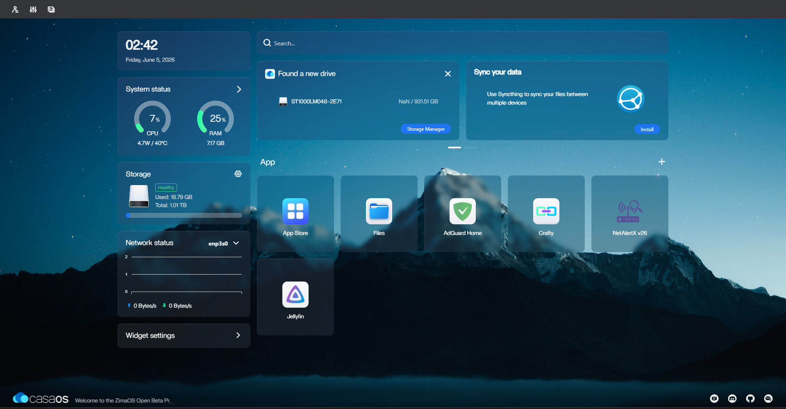

# 🏡 Laptop Home Server

> **Design and Implementation of a Personal Homelab powered by a Linux Server on the CasaOS Platform: Centralizing Data Management, Network Security, and Multiple Services to Build a Private Home Cloud and Achieve Complete Independence from Global Public Clouds.**


---

## 📑 Table of Contents

1. [Abstract](#1-abstract)
2. [Project Introduction](#2-project-introduction)
   - [2.1 Vision & Purpose](#21-vision--purpose)
   - [2.2 Theoretical Background (Linux & Self-Hosting)](#22-theoretical-background)
   - [2.3 Project Goals](#23-project-goals)
3. [System Architecture & Infrastructure](#3-system-architecture--infrastructure)
   - [3.1 Physical Network Topology](#31-physical-network-topology)
   - [3.2 Server Hardware](#32-server-hardware)
   - [3.3 Server Structure & Software](#33-server-structure--software)
   - [3.4 Repository & Server Directory Structure](#34-repository--server-directory-structure)
4. [Services Analysis (Implementation & Troubleshooting)](#4-services-analysis)
   - [4.1 AdGuard Home & Quad9 DoH (Security Server)](#41-adguard-home--quad9-doh)
   - [4.2 File Server, Automations & Backup Strategy](#42-file-server-automations--backup-strategy)
   - [4.3 Game Server Management (Crafty) & Playit.gg](#43-game-server-management-crafty--playitgg)
   - [4.4 Media Server (Jellyfin)](#44-media-server-jellyfin)
   - [4.5 Tailscale (Mesh VPN)](#45-tailscale-mesh-vpn)
   - [4.6 NetAlertX (Network Monitoring)](#46-netalertx-network-monitoring)
5. [Future Expansions](#5-future-expansions)
6. [Conclusions](#6-conclusions)

---

## 1. Abstract

This project presents the architecture, deployment, and documentation of a comprehensive, self-hosted **Homelab** tailored specifically for my large family's residence. Designed to achieve digital sovereignty and complete independence from commercial public clouds (*De-Clouding*), the system is built to facilitate the everyday digital needs of our household, offering easy data management, robust security, and centralized entertainment.

By upcycling an older personal laptop that was about to be retired following a hardware upgrade—giving it a second life and preventing e-waste, while inherently taking advantage of its built-in battery as an Uninterruptible Power Supply (UPS)—this initiative establishes a robust, highly available, and cost-effective private cloud ecosystem. The infrastructure is powered by a **Linux Server** environment and managed through the **CasaOS** platform, utilizing **Docker containerization** for isolated, scalable, and efficient service deployment.

The architecture is built upon five foundational pillars:

* **🛡️ Security & Safe Browsing:** Implementing network-wide protection against ads, trackers, and malware via **AdGuard Home** to ensure a highly secure internet surfing experience for all family members, routing requests through encrypted DNS (DoH/DNSSEC) via **Quad9**.
* **📂 Data Management & Family Sharing:** A centralized **Local File Server (NAS)** that provides the entire family with effortless access, sharing, and management of their personal files, backed by custom scripting for automated directory backups to an external 1TB drive.
* **🌍 Secure Remote Access (VPN):** Eliminating the risks of traditional port forwarding by utilizing **Tailscale** (Mesh VPN) for encrypted remote access and management—allowing family members to safely connect to home services from anywhere—and **Playit.gg** (Reverse Tunneling) to safely expose local game servers.
* **🎮 Entertainment Hub:** Self-hosting a centralized media library for family movie nights via **Jellyfin** (Media Server) and managing a dedicated Minecraft Game Server for recreation through the **Crafty Controller** web interface.
* **📡 Local Network Monitoring:** Utilizing **NetAlertX** as a continuous network scanner for intrusion detection and centralized administration of all connected devices.

Ultimately, this homelab serves as a centralized hub demonstrating how enterprise-grade network management, stringent data privacy, and diverse digital services can be successfully consolidated to elevate the digital lifestyle of a modern household.

---

## 2. Project Introduction

### 2.1 Vision & Purpose

In an era where personal and digital lives are increasingly reliant on commercial tech giants (Big Tech), the core vision of this project is **"De-Clouding"**—the deliberate migration away from public cloud services (such as Google Drive, iCloud, or Dropbox) to regain absolute control over personal data. 

Beyond data sovereignty, this project is driven by a commitment to resourcefulness and sustainability. By **upcycling an aging personal laptop** that would have otherwise been left idle after a recent equipment upgrade, the project actively prevents electronic waste (e-waste) and transforms older hardware into a powerful, centralized network hub. The purpose is to prove that enterprise-grade security, seamless data syncing, and high-quality digital services can be achieved at home without expensive hardware or monthly subscription fees.

### 2.2 Theoretical Background (Linux & Self-Hosting)

To understand the architecture of this homelab, two core concepts must be defined:

* **Self-Hosting:** This is the practice of running and maintaining software applications on your own private server rather than consuming them as Software-as-a-Service (SaaS) from third parties. Self-hosting shifts the paradigm from "renting digital space" to "owning your digital infrastructure," guaranteeing that data never leaves the local network unless explicitly authorized.
* **Linux as the Foundation:** The server is powered by a minimal Linux distribution. Linux is the undisputed industry standard for server environments due to its open-source nature, unparalleled stability, and low resource overhead. By combining Linux with the **CasaOS** platform, the system utilizes **Docker containerization**. Containers ensure that every service runs in its own isolated environment with its own dependencies, preventing system conflicts and allowing for effortless updates and scalability.

### 2.3 Project Goals

The implementation of this laptop-based homelab was guided by the following concrete objectives:

1. **Complete Data Ownership:** Deploy a reliable Local Area Network (LAN) File Server / NAS for rapid data transfer and media storage.
2. **Network-Wide Security:** Implement a DNS-level sinkhole to block ads, malicious domains, and trackers for every device connected to the home router, while encrypting outbound DNS requests.
3. **Secure Remote Access (VPN):** Establish a secure, encrypted tunnel to the local network from anywhere in the world, eliminating the need for vulnerable port forwarding.
4. **Self-Hosted Entertainment:** Run lag-free, dedicated gaming environments (Minecraft) and media streaming platforms (Jellyfin) managed via intuitive web interfaces.
5. **Hardware Efficiency & Resilience:** Capitalize on the laptop's built-in battery to act as an Uninterruptible Power Supply (UPS), ensuring the server remains active and safely shuts down during unexpected power outages.

---

## 3. System Architecture & Infrastructure

This section outlines the physical and logical layers of the homelab, detailing the network topology, the upcycled hardware acting as the core server, and the underlying software environment.

### 3.1 Physical Network Topology

The network is designed to support a large household (6 individuals) with numerous concurrent devices, ensuring high throughput, minimal latency, and future scalability. The foundation of the external connection is a Fiber-to-the-Home (FTTH) line providing speeds of **1000/500 Mbps**.


> *Figure 1: Logical and Physical Flow of the Homelab Environment*

**Core Networking Components & IP Allocation:**
To maintain network stability and avoid conflicts, a strict IP allocation strategy is enforced.
* **ISP Router (Gateway - `192.168.1.1`):** A Sercomm Speedport Plus 2 (Wi-Fi 6 certified) serves as the primary gateway to the WAN.
* **Core Switch:** A **TP-Link TL-SG1016PE v3 (16-Port Gigabit PoE+)**. Housed within a 19-inch rack for optimal cable management. The Power over Ethernet (PoE+) capability and high port count provide massive scalability for future projects (e.g., Access Points).
* **DHCP vs Static Pool:** Handled directly by the ISP router's built-in DHCP server, the IP range `192.168.1.1` to `192.168.1.10` is strictly reserved for **Static IP assignments** (e.g., the Laptop Server is pinned to `192.168.1.2`). The remaining pool (`192.168.1.11` to `192.168.1.254`) is dynamically allocated to client devices.
* **Cabling:** All hardwired connections utilize **Lanberg S/FTP Cat.6a** cables. The Shielded Foiled Twisted Pair (S/FTP) construction eliminates electromagnetic interference, effortlessly handling 1Gbps traffic while being future-proofed for 10Gbps.

**Connected Local Hosts:**
* **Wired (Ethernet via Switch):** 2x Desktop PCs, 1x Laptop, and the central Homelab Server (`192.168.1.2`).
* **Wireless (Wi-Fi 6 via Router):** 1x Smart TV, 2x Tablets, and 4-5 Smartphones.

### 3.2 Server Hardware

The core of the homelab is built upon a repurposed gaming laptop. This upcycling strategy provides a massive advantage for server hosting: the internal 6-Cell battery acts as a built-in Uninterruptible Power Supply (UPS), guaranteeing graceful shutdowns during power outages.

<p align="center">
  
  
</p>

> *Figure 2: The upcycled MSI Laptop acting as the central server, securely mounted above the 19-inch rack infrastructure, displaying real-time resource monitoring via terminal.*

**System Specifications: MSI GL62M 7REX & External Storage**
| Hardware Component | Specifications / Model | Details & Purpose |
| :--- | :--- | :--- |
| **CPU** | Intel Core i7-7700HQ @ 2.80GHz | 7th Gen (Kaby Lake), 4 Cores / 8 Threads. Provides excellent multi-tasking for concurrent Docker containers. |
| **RAM** | 8GB DDR4 | 1x 8GB installed (1 slot free, upgradeable to 32GB). Sufficient for the current container load. |
| **GPU (Dedicated)** | NVIDIA GeForce GTX 1050 Ti | 2GB GDDR5. Fully active and utilized for Hardware-Accelerated Video Transcoding in Jellyfin, delivering seamless media streaming. |
| **OS Drive (Disk 1)** | 120GB SSD (Kingston RBUSNS8) | M.2 SSD. Houses the Linux OS and the Docker engine for rapid boot times. |
| **Storage Drive (Disk 2)**| 1TB HDD (Seagate ST1000LM048) | 2.5" SATA. Primary internal mass storage for the NAS and media files. |
| **Backup Drive (External)**| 1TB HDD (WD Elements) | USB 3.0 External Drive. Dedicated destination for automated scripts and system backups, ensuring critical data redundancy outside the internal chassis. |
| **Power Supply** | AC Adapter (150W) & Li-Ion Battery | 6-Cell (41 Whr) battery ensuring 100% uptime during short electrical grid fluctuations. |

*(Note: The system is configured to prioritize the dedicated NVIDIA GPU for hardware-accelerated tasks, such as real-time video transcoding, significantly offloading the CPU during high-demand media consumption).*

### 3.3 Server Structure & Software

To maximize the hardware's efficiency, a "bare-metal to container" approach was adopted.


> *Figure 3: The CasaOS Web Interface managing the system resources and Docker Containers.*

1. **Host Operating System:** A minimal Linux Server distribution acts as the bare-metal foundation, eliminating the overhead of a Desktop Environment (GUI).
2. **CasaOS (The Dashboard):** Deployed on top of Linux, CasaOS serves as the central orchestration interface. It provides an elegant, web-based UI to monitor system resources and manage storage drives.
3. **Docker Containerization:** Every service in this homelab (AdGuard, Jellyfin, Crafty, etc.) runs as an isolated Docker Container managed through CasaOS, ensuring that dependencies never conflict.

### 3.4 Repository & Server Directory Structure

To maintain organization and ensure the infrastructure is easily reproducible, the repository and server configuration files are structured as follows:

```text
Laptop-Home-Server/
├── docker-compose/              # 🐳 Server-side Docker Compose files for deployments
│   ├── adguard-home/            # DNS security configuration
│   ├── jellyfin/                # Media server volume mappings
│   ├── crafty-controller/       # Minecraft server management configs
│   └── netalertx/               # Network monitoring setup
├── scripts/                     # ⚙️ Custom automation & maintenance scripts
│   └── auto_backup.sh           # Script syncing NAS data to the 1TB WD Elements
├── images/                      # 🖼️ Assets for GitHub documentation
│   ├── physical_server1.jpg     # Physical rack setup (Angle 1)
│   ├── physical_server2.jpg     # Physical rack setup (Angle 2)
│   ├── casaos_dashboard.png
│   ├── topology_Diagram.drawio
│   ├── topology_Diagram.png
│   └── topology_Diagram_with_grid.png
├── .gitattributes               # Git configuration
├── LICENSE                      # Open Source License
└── README.md                    # This master documentation file
```

---

## 4. Services Analysis (Implementation & Troubleshooting)

This section delves into the core software services that transform the physical hardware into a fully functional, self-hosted cloud environment. 

To achieve maximum stability and modularity, a strict **Container-First** philosophy was adopted. Instead of installing software directly onto the host operating system, every service is deployed as an isolated **Docker Container** and managed through the **CasaOS** interface. 

This architectural choice provides several critical advantages for a homelab environment:
* **Isolation & Stability:** Applications run in their own secure environments with bundled dependencies. If one service encounters an error or crashes, the host operating system and other running containers remain completely unaffected.
* **Persistent Data Management:** Configuration files and user data are mapped to specific directories on the physical storage drives (Docker Volumes). This ensures that containers can be safely updated, wiped, or recreated without any data loss.
* **Portability & Maintenance:** The entire infrastructure is reproducible. Updating a service is as simple as pulling the latest Docker image, minimizing downtime and maintenance overhead.

In the following subsections, each core service is analyzed individually. The documentation covers the specific **Implementation** strategy (deployment logic, network configurations, and family use cases) along with the **Troubleshooting** steps taken to overcome technical hurdles during the initial setup process.

### 4.1 AdGuard Home & Quad9 DoH (Security Server)

The foundation of the homelab's network security is **AdGuard Home**, acting as a network-wide DNS sinkhole. By pointing the ISP router's primary DHCP DNS settings to the laptop server's IP (`192.168.1.2`), every device connected to the network—from desktop PCs and smartphones to the LG WebOS Smart TV—automatically routes its DNS queries through this container. This eliminates the need to install individual ad-blockers on separate client devices.

<p align="center">
  
  
</p>

> *Figure 4: The AdGuard Home Dashboard showcasing real-time statistics, upstream response times, and active Tailscale VPN clients (`100.x.x.x`).*

**1. Docker Deployment via CasaOS**
The service is deployed using the official `adguard/adguardhome:v0.107.76` image running on a `bridge` network. To ensure stability and avoid port conflicts, the container is meticulously configured:
* **Port Mappings:** The standard DNS port `53` (TCP/UDP) is exposed directly to the host to accept local network queries. The Web UI is mapped to port `3001` (Host) -> `80` (Container) to prevent overlap with other web services. Ports `853` and `784` are also exposed for DNS-over-TLS and DNS-over-QUIC capabilities.
* **Persistent Volumes:** Critical configuration and working directories are mapped to `/DATA/AppData/adguard-home/conf` and `/opt/adguardhome/work`. This ensures that custom filters, logs, and statistical data (set to a 90-day log retention and 24-hour active statistic retention) survive container reboots and image updates.
* **Resource Allocation:** The container is set to "High" CPU shares with an "unless-stopped" restart policy, guaranteeing maximum availability as a critical network component.

**2. Upstream DNS, Privacy & Redundancy**
A primary goal of this homelab is ISP independence and absolute data privacy. Standard DNS queries are sent in plain text, making them visible to Internet Service Providers. To solve this, AdGuard Home is configured to use **DNS-over-HTTPS (DoH)** with a highly redundant architecture:
* **Primary Upstream:** All outbound queries are encrypted and routed to `https://dns.quad9.net/dns-query` (Quad9). Quad9 was selected for its strict privacy policies and built-in threat intelligence against malware domains.
* **Fallback Strategy:** To ensure zero network downtime in the event of a Quad9 outage, `https://dns.cloudflare.com/dns-query` is configured as a dedicated Fallback DNS server. 
* **Bootstrap DNS Resolvers:** To prevent the "chicken-and-egg" problem of resolving the DoH server hostnames (`dns.quad9.net` and `dns.cloudflare.com`) before encrypted DNS is established, reliable Bootstrap IPs are defined (`9.9.9.9`, `149.112.112.112`, and IPv6 equivalents).
* **Routing Strategy:** The "Parallel Requests" load-balancing algorithm is enabled. AdGuard queries all configured upstreams simultaneously and uses the fastest response, dramatically reducing DNS resolution times.
* **DNSSEC Enforced:** Domain Name System Security Extensions (DNSSEC) is strictly enforced to prevent DNS spoofing and cache-poisoning attacks.

**3. Comprehensive Filtering Architecture**
The filtering engine is highly customized, successfully intercepting and neutralizing approximately **28% of all network traffic** at the DNS level. The blocklist matrix relies on a combination of community-driven lists (updated automatically every 12 hours) and native security features:

<p align="center">
  
</p>

> *Figure 5: The active DNS blocklists, strategically selected to neutralize ads, trackers, and malware without breaking core web functionality.*

* **General Ad & Tracker Blocking:**
  * **AdGuard DNS Filter:** The core filter, optimized specifically for DNS-level blocking of ads and trackers.
  * **OISD Blocklist Small:** A highly curated, "set-and-forget" list that aggressively blocks ads and telemetry with virtually zero false positives.
  * **HaGeZi's Normal Blocklist:** An excellent, balanced list targeting advertising, tracking, and metrics domains, designed to clean up the internet experience without breaking legitimate web functionality.
  * **AdAway Default Blocklist:** A mobile-focused blocklist, crucial for stopping in-app advertisements and analytics tracking on family smartphones and tablets.
  * **Steven Black's List:** A legendary, consolidated hosts file that blocks a massive array of adware and malware domains.

* **Specialized & Regional Filtering:**
  * **Perflyst and Dandelion Sprout's Smart-TV Blocklist:** Specifically chosen to combat the aggressive telemetry and built-in advertising found in modern Smart TVs (like the household's LG WebOS TV).
  * **Greek AdBlock Filter:** A regional blocklist tailored to eliminate local advertisements and trackers specific to the Greek webspace.

* **Malware, Phishing & Content Protection:**
  * **uBlock filters – Badware risks:** Blocks domains known to host or distribute badware/malware.
  * **Phishing URL Blocklist (PhishTank):** Intercepts requests to known phishing sites aiming to steal credentials.
  * **Malicious URL Blocklist (URLHaus):** Blocks domains associated with malware distribution and botnet command-and-control servers.
  * **AdGuard Browsing Security Web Service:** Actively enabled. AdGuard checks domain hashes against a real-time, privacy-friendly API to block zero-day malicious domains before the static lists can update.
  * **Enforced Safe Search:** To ensure a family-friendly environment, Safe Search is strictly enforced at the network level across all major search engines (Google, Bing, DuckDuckGo, YouTube, Yandex, etc.), preventing explicit content from appearing in search results.

**4. Local Network Resolution (Reverse DNS)**
A common issue in containerized DNS servers is that client requests appear to originate from the Docker gateway or present as raw IP addresses, making monitoring difficult. This was resolved by enabling **Private Reverse DNS Resolvers**. 
By pointing the reverse DNS resolver directly to the ISP Router (`192.168.1.1`), AdGuard successfully performs Reverse Resolving of clients' IP addresses. This allows the dashboard to correctly identify internal hostnames (e.g., `LGwebOSTV.home` or `DESKTOP-5Q3AJKM.home`), as well as external devices tunneling in via the Tailscale VPN subnet (`100.x.x.x`).

**5. Performance Optimization**
To further enhance network speed, **Optimistic Caching** is enabled alongside a 4MB dedicated DNS cache. This allows the server to serve expired cache entries instantly to the user while silently refreshing the domain TTL in the background, making web browsing feel instantaneous for the entire household.

#### Troubleshooting & Network Conflicts
During the initial deployment and stabilization phase, several core networking conflicts were identified and resolved to ensure seamless operation:

* **Port 53 Allocation Conflict:** The host operating system (Ubuntu) had port `53` bound to the internal `systemd-resolved` daemon, preventing the Docker container from listening for DNS queries. The daemon was permanently disabled via the terminal (`sudo systemctl disable systemd-resolved`), and the CasaOS mapping was corrected to route Host port `53` directly to Container port `53`.
* **Host DNS Resolution Failure:** Disabling the default DNS stub left the bare-metal OS without internet resolution capabilities (`DNS_PROBE_POSSIBLE`). This was fixed by manually overriding the `/etc/resolv.conf` file to point the host's nameserver directly to `127.0.0.1` (the local container).
* **Web UI Port Mismatch:** Following the setup wizard, the container's internal web server automatically migrated from port `3000` to port `80`, resulting in a "Connection Refused" error. The CasaOS configuration was updated to map Host port `3001` to Container port `80`, restoring dashboard access.
* **The IPv6 Bypass Leak:** Windows client devices were bypassing the AdGuard sinkhole by prioritizing IPv6 DNS addresses automatically provided by the ISP Router. This leak was plugged by disabling IPv6 on the client network adapters and enforcing the "Disable resolving of IPv6 addresses" rule within AdGuard, forcing all traffic through the controlled IPv4 tunnel.
* **Browser-Level DoH Conflicts:** Client browsers with "Secure DNS" enabled internally (e.g., Chromium browsers routing to Cloudflare) were bypassing the local network entirely. This was resolved by disabling browser-level secure DNS, thereby centralizing the DoH encryption process at the AdGuard server level to achieve both privacy and network-wide ad-blocking.
* **Reverse DNS Anomalies:** Public IPs (such as Google's `8.8.8.8`) were polluting the local query logs because AdGuard defaulted to public servers for internal Reverse DNS lookups. This was rectified by explicitly assigning the ISP Router (`192.168.1.1`) as the sole Private Reverse DNS resolver, ensuring accurate identification of local hostnames.
* **Upstream Latency Spikes:** Initial configurations relying on a single upstream provider (Cloudflare) via Load-Balancing resulted in sluggish response times (~199ms). Introducing Quad9 as an additional upstream and switching to a "Parallel requests" algorithm drastically reduced average lookup times to ~42ms.

### 4.2 File Server, Automations & Backup Strategy (NAS)

The file management architecture transcends a simple Network Attached Storage (NAS) setup, functioning as a fully automated, **Zero Trust Private Cloud**. It ensures strict user isolation, automated data lifecycle management, and a robust backup strategy utilizing an external 1TB USB 3.0 drive.

**1. File System & Storage Preparation**
While Linux natively supports NTFS, the external 1TB backup drive (`Storage2`) was deliberately formatted to **EXT4** directly via the CasaOS Storage Manager. NTFS lacks native support for Linux file ownership and permissions, which could cause critical access errors for background services and Cron jobs. EXT4 guarantees maximum throughput, stability, and absolute compatibility with the Linux ecosystem.

<p align="center">
  
</p>

> *Figure 6: The CasaOS interface displaying the internal storage structure and the isolated `BACKUP FILES` directory.*

**2. Access Control & Samba Configuration (Zero Trust Local Access)**
To enforce strict privacy among family members, the default CasaOS UI sharing mechanisms were bypassed. Relying on the GUI caused hierarchy conflicts (sharing a parent directory automatically unshared child directories). Instead, access was hardcoded at the OS OSI Layer 7 level via the `/etc/samba/smb.conf` file.

* **System-Level User Security:** To protect the server from Local Privilege Escalation exploits (such as Linux kernel Use-After-Free CVE-2026-23111), the family members were added as system users explicitly without home directories and without shell access. This ensures they can authenticate to the SMB share but cannot open an SSH terminal or execute malicious code. The following commands were executed:
  ```bash
  sudo useradd -M -s /sbin/nologin raphael
  sudo useradd -M -s /sbin/nologin christina
  sudo useradd -M -s /sbin/nologin markella
  sudo useradd -M -s /sbin/nologin panagiotis
  ```

* **Credential Management:** Passwords for all users (including the admin) were independently set directly into the Samba database, ensuring credentials remain strictly encrypted:
  ```bash
  sudo smbpasswd -a raphael
  sudo smbpasswd -a christina
  sudo smbpasswd -a markella
  sudo smbpasswd -a panagiotis
  ```

* **Samba Isolation (The Configuration File):** The main Samba configuration file was opened via the terminal:
  ```bash
  sudo nano /etc/samba/smb.conf
  ```
  At the very end of the file, the following strict access rules were appended to lock personal directories behind the `valid users` directive, while keeping the `COMMON (SHARED)` directory open for family exchange:
  ```ini
  [COMMON]
     path = /mnt/Storage1/COMMON (SHARED)
     browsable = yes
     writable = yes
     valid users = raphael, christina, markella, panagiotis

  [RAFAIL]
     path = /mnt/Storage1/RAFAIL
     browsable = yes
     writable = yes
     valid users = raphael

  [CHRISTINA]
     path = /mnt/Storage1/CHRISTINA
     browsable = yes
     writable = yes
     valid users = christina

  [MARKELLA]
     path = /mnt/Storage1/MARKELLA
     browsable = yes
     writable = yes
     valid users = markella

  [PANAGIOTIS]
     path = /mnt/Storage1/PANAGIOTIS
     browsable = yes
     writable = yes
     valid users = panagiotis
  ```
  After saving the file (`Ctrl+O`, `Enter`, `Ctrl+X`), the Samba service was restarted to apply the new architecture:
  ```bash
  sudo systemctl restart smbd
  ```

<p align="center">
  
  
</p>

> *Figure 7: The strict, user-isolated Samba directory structure alongside the Windows Network Credentials prompt enforcing secure, authenticated access.*

**3. Data Lifecycle Automations (Cron Jobs)**
To prevent storage exhaustion and ensure data redundancy, the system relies on carefully scheduled Cron jobs, split between the Root and User crontabs. The scheduling utilizes the "Maintenance Window" (04:00 - 06:00 AM) to avoid network congestion.

* **System Cleanup (Root Crontab):** To clear obsolete packages and keep the OS SSD lightweight, the root crontab was accessed:
  ```bash
  sudo crontab -e
  ```
  The following job was added to run every Sunday at 04:30 AM:
  ```bash
  30 4 * * 0 apt-get autoremove -y && apt-get clean
  ```

* **File Automations & Backups (User Crontab):** To manage the data lifecycle, the standard user crontab was accessed:
  ```bash
  crontab -e
  ```
  The following three jobs were added to handle the Smart Trash and Backup processes:
  ```bash
  # 1. Smart Trash: Deletes files in COMMON older than 30 days (Daily at 05:00 AM)
  0 5 * * * find "/mnt/Storage1/COMMON (SHARED)/" -mindepth 1 -mtime +30 -delete
  
  # 2. Weekly Backup: Archives data to external drive without deleting old files (Sundays at 04:00 AM)
  0 4 * * 0 rsync -av /mnt/Storage1/ "/mnt/Storage2/BACKUP FILES/"
  
  # 3. Backup Purge: Deletes files in the BACKUP's COMMON folder older than 90 days (Daily at 06:00 AM)
  0 6 * * * find "/mnt/Storage2/BACKUP FILES/COMMON (SHARED)/" -mindepth 1 -mtime +90 -delete
  ```

**4. Dual Access Strategy (Smart Routing)**
Accessing the server files is optimized through a Split Tunneling approach. Local machines feature two distinct network shortcuts:

<p align="center">
  
</p>

> *Figure 8: Smart routing execution via dedicated Windows shortcuts separating Local Area Network (LAN) traffic from encrypted Virtual Private Network (VPN) traffic.*

* **LAN Shortcut (`\\192.168.1.2`):** Bypasses the VPN entirely to achieve raw 1000 Mbps Gigabit speeds when physically at home.
* **VPN Shortcut (`\\100.x.x.x`):** Routes via the Tailscale WireGuard tunnel, offering encrypted, Zero-Trust access to the files from anywhere in the world, even on untrusted public Wi-Fi.

#### Troubleshooting & Problem Resolution
* **Physical Layer Packet Loss (VPN Instability):** The Tailscale VPN experienced frequent, random disconnects. Diagnosis revealed the TP-Link switch port indicator was Orange (10/100Mbps) instead of Green (1000Mbps). A physical contact issue in the Cat6a ethernet cable pins caused the auto-negotiation to drop to 100Mbps, resulting in micro-packet loss. While basic web browsing masked the packet loss via retransmissions, the strict WireGuard encrypted tunnel collapsed. Reseating the cable restored the Gigabit link and permanently stabilized the VPN.
* **Windows SMB Caching ("This folder is empty" error):** When adjusting folder sharing through the CasaOS UI, the Samba daemon hierarchy broke. Even after manual `smb.conf` deployment, Windows client machines displayed an empty network drive. This was resolved by forcing Windows to flush its SMB cache by deleting all existing server entries in the Windows Credential Manager, executing an "Unshare" action in the CasaOS UI, and issuing `sudo systemctl restart smbd`.
* **Cron `-mtime` Logic Misinterpretation & Linux Case-Sensitivity:** An initial assumption was made that the 30-day purge script had failed because a file (`word.zip`) remained in the COMMON folder. Debugging commenced by verifying the exact file name using `ls -lh "/mnt/Storage1/COMMON (SHARED)/"` (to account for strict Linux case-sensitivity). Using the `stat "/mnt/Storage1/COMMON (SHARED)/word.zip"` command in the terminal revealed the file's `Modify` timestamp was exactly 24 days old. A subsequent dry run using `find ... -mtime +30` (without the `-delete` flag) confirmed the script was executing flawlessly, correctly ignoring files that had not strictly crossed the 30-day threshold.
