# 🏡 Laptop Home Server

> **Design and Implementation of a Personal Homelab powered by a Linux Server on the CasaOS Platform: Centralizing Data Management, Network Security, and Multiple Services to Build a Private Home Cloud and Achieve Complete Independence from Global Public Clouds.**


---

## 📑 Table of Contents

1. [Abstract](#1-abstract)
2. [Project Introduction](#2-project-introduction)
   - [2.1 Vision & Purpose](#21-vision-purpose)
   - [2.2 Theoretical Background (Linux & Self-Hosting)](#22-theoretical-background-linux-self-hosting)
   - [2.3 Project Goals](#23-project-goals)
3. [System Architecture & Infrastructure](#3-system-architecture-infrastructure)
   - [3.1 Physical Network Topology](#31-physical-network-topology)
   - [3.2 Server Hardware](#32-server-hardware)
   - [3.3 Bare-Metal Provisioning & EFI Troubleshooting](#33-bare-metal-provisioning-efi-troubleshooting)
   - [3.4 Headless Server Configuration & CasaOS Deployment](#34-headless-server-configuration-casaos-deployment)
     - [3.4.1 OpenSSH Vulnerability Mitigation & SSH Hardening](#341-openssh-vulnerability-mitigation-ssh-hardening)
   - [3.5 Repository & Server Directory Structure](#35-repository-server-directory-structure)
   - [3.6 Host Network Configuration & OS-Level Hardening](#36-host-network-configuration-os-level-hardening)
4. [Services Analysis (Implementation & Troubleshooting)](#4-services-analysis-implementation-troubleshooting)
   - [4.1 AdGuard Home & Quad9 DoH (Security Server)](#41-adguard-home-quad9-doh-security-server)
   - [4.2 File Server, Automations & Backup Strategy (NAS)](#42-file-server-automations-backup-strategy-nas)
   - [4.3 Tailscale (Mesh VPN)](#43-tailscale-mesh-vpn)
   - [4.4 Game Server Management (Crafty) & Playit.gg](#44-game-server-management-crafty-playitgg)
     - [4.4.1 Secure Public Exposure & Tunneling Architecture (Playit.gg)](#441-secure-public-exposure-tunneling-architecture-playitgg)
   - [4.5 Media Server (Jellyfin)](#45-media-server-jellyfin)
   - [4.6 NetAlertX (Network Monitoring)](#46-netalertx-network-monitoring)
5. [Future Expansions](#5-future-expansions)
6. [Conclusions](#6-conclusions)

---

<a id="1-abstract"></a>
## 1. Abstract

This project presents the architecture, deployment, and documentation of a comprehensive, self-hosted **Homelab** tailored specifically for my large family's residence. Designed to achieve digital sovereignty and complete independence from commercial public clouds (*De-Clouding*), the system is built to facilitate the everyday digital needs of our household, offering easy data management, robust security, and centralized entertainment.

By upcycling an older personal laptop that was about to be retired following a hardware upgrade—giving it a second life and preventing e-waste, while inherently taking advantage of its built-in battery as an Uninterruptible Power Supply (UPS)—this initiative establishes a robust, highly available, and cost-effective private cloud ecosystem. The infrastructure is powered by a **Linux Server** environment and managed through the **CasaOS** platform, utilizing **Docker containerization** for isolated, scalable, and efficient service deployment.

The architecture is built upon five foundational pillars:

* **🛡️ Security & Safe Browsing:** Implementing network-wide protection against ads, trackers, and malware via **AdGuard Home** to ensure a highly secure internet surfing experience for all family members, routing requests through encrypted DNS (DoH/DNSSEC) via **Quad9**.
* **📂 Data Management & Family Sharing:** A centralized **Local File Server (NAS)** that provides the entire family with effortless access, sharing, and management of their personal files, backed by custom scripting for automated directory backups to an external 1TB drive.
* **🌍 Secure Remote Access (VPN):** Eliminating the risks of traditional port forwarding by utilizing **Tailscale** (Mesh VPN) for encrypted remote access and management—allowing family members to safely connect to home services from anywhere—and **Playit.gg** (Reverse Tunneling) to safely expose local game servers.
* **🎮 Entertainment Hub:** Self-hosting a centralized media library for family movie nights via **Jellyfin** (Media Server) and managing a dedicated Minecraft Game Server for recreation through the **Crafty Controller** web interface.
* **📡 Local Network Monitoring:** Utilizing **NetAlertX** as a continuous network scanner for intrusion detection and centralized administration of all connected devices.

Ultimately, this homelab serves as a centralized hub demonstrating how enterprise-grade network management, stringent data privacy, and diverse digital services can be successfully consolidated to elevate the digital lifestyle of a modern household.

---

<a id="2-project-introduction"></a>
## 2. Project Introduction

<a id="21-vision-purpose"></a>
### 2.1 Vision & Purpose

In an era where personal and digital lives are increasingly reliant on commercial tech giants (Big Tech), the core vision of this project is **"De-Clouding"**—the deliberate migration away from public cloud services (such as Google Drive, iCloud, or Dropbox) to regain absolute control over personal data. 

Beyond data sovereignty, this project is driven by a commitment to resourcefulness and sustainability. By **upcycling an aging personal laptop** that would have otherwise been left idle after a recent equipment upgrade, the project actively prevents electronic waste (e-waste) and transforms older hardware into a powerful, centralized network hub. The purpose is to prove that enterprise-grade security, seamless data syncing, and high-quality digital services can be achieved at home without expensive hardware or monthly subscription fees.

<a id="22-theoretical-background-linux-self-hosting"></a>
### 2.2 Theoretical Background (Linux & Self-Hosting)

To understand the architecture of this homelab, two core concepts must be defined:

* **Self-Hosting:** This is the practice of running and maintaining software applications on your own private server rather than consuming them as Software-as-a-Service (SaaS) from third parties. Self-hosting shifts the paradigm from "renting digital space" to "owning your digital infrastructure," guaranteeing that data never leaves the local network unless explicitly authorized.
* **Linux as the Foundation:** The server is powered by a minimal Linux distribution. Linux is the undisputed industry standard for server environments due to its open-source nature, unparalleled stability, and low resource overhead. By combining Linux with the **CasaOS** platform, the system utilizes **Docker containerization**. Containers ensure that every service runs in its own isolated environment with its own dependencies, preventing system conflicts and allowing for effortless updates and scalability.

<a id="23-project-goals"></a>
### 2.3 Project Goals

The implementation of this laptop-based homelab was guided by the following concrete objectives:

1. **Complete Data Ownership:** Deploy a reliable Local Area Network (LAN) File Server / NAS for rapid data transfer and media storage.
2. **Network-Wide Security:** Implement a DNS-level sinkhole to block ads, malicious domains, and trackers for every device connected to the home router, while encrypting outbound DNS requests.
3. **Secure Remote Access (VPN):** Establish a secure, encrypted tunnel to the local network from anywhere in the world, eliminating the need for vulnerable port forwarding.
4. **Self-Hosted Entertainment:** Run lag-free, dedicated gaming environments (Minecraft) and media streaming platforms (Jellyfin) managed via intuitive web interfaces.
5. **Hardware Efficiency & Resilience:** Capitalize on the laptop's built-in battery to act as an Uninterruptible Power Supply (UPS), ensuring the server remains active and safely shuts down during unexpected power outages.

---

<a id="3-system-architecture-infrastructure"></a>
## 3. System Architecture & Infrastructure

This section outlines the physical and logical layers of the homelab, detailing the network topology, the upcycled hardware acting as the core server, the bare-metal provisioning process, and the underlying software environment.

<a id="31-physical-network-topology"></a>
### 3.1 Physical Network Topology

The network is designed to support a large household (6 individuals) with numerous concurrent devices, ensuring high throughput, minimal latency, and future scalability. The foundation of the external connection is a Fiber-to-the-Home (FTTH) line providing speeds of **1000/500 Mbps**.

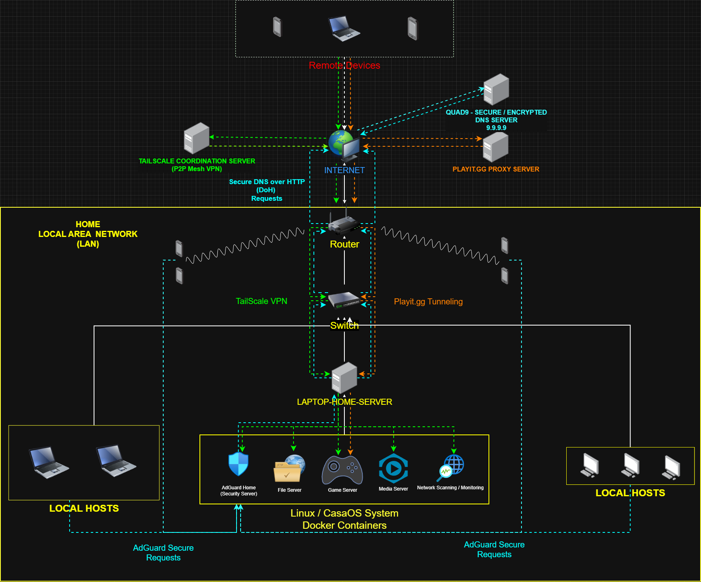

> *Figure 1: Logical and Physical Flow of the Homelab Environment*

**Core Networking Components & IP Allocation:**
To maintain network stability and avoid conflicts, a strict IP allocation strategy is enforced.
* **ISP Router (Gateway - `192.168.1.1`):** A Sercomm Speedport Plus 2 (Wi-Fi 6 certified) serves as the primary gateway to the WAN.
* **Core Switch:** A **TP-Link TL-SG1016PE v3 (16-Port Gigabit PoE+)**. Housed within a 19-inch rack for optimal cable management. The Power over Ethernet (PoE+) capability and high port count provide massive scalability for future projects (e.g., Access Points).
* **DHCP vs Static Pool:** Handled directly by the ISP router's built-in DHCP server, the IP range `192.168.1.1` to `192.168.1.10` is strictly reserved for **Static IP assignments** (e.g., the Laptop Server is pinned to `192.168.1.2`). The remaining pool (`192.168.1.11` to `192.168.1.254`) is dynamically allocated to client devices.
* **Cabling:** All hardwired connections utilize **Lanberg S/FTP Cat.6a** cables. The Shielded Foiled Twisted Pair (S/FTP) construction eliminates electromagnetic interference, effortlessly handling 1Gbps traffic while being future-proofed for 10Gbps.

**Connected Local Hosts:**
* **Wired (Ethernet via Switch):** 2x Desktop PCs, 1x Laptop, and the central Homelab Server (`192.168.1.2`).
* **Wireless (Wi-Fi 6 via Router):** 1x Smart TV, 2x Tablets, and 4-5 Smartphones.

<a id="32-server-hardware"></a>
### 3.2 Server Hardware

The core of the homelab is built upon a repurposed gaming laptop. This upcycling strategy provides a massive advantage for server hosting: the internal 6-Cell battery acts as a built-in Uninterruptible Power Supply (UPS), guaranteeing graceful shutdowns during power outages.

<p align="center">
  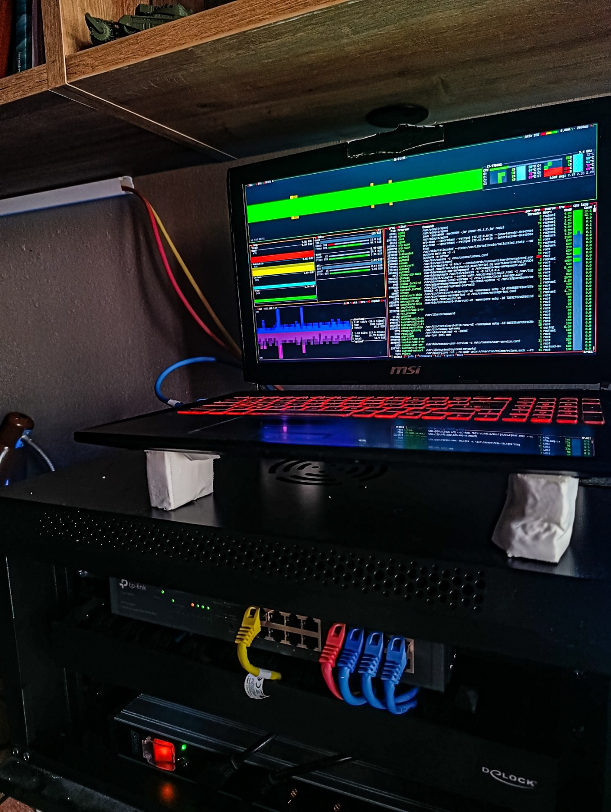
  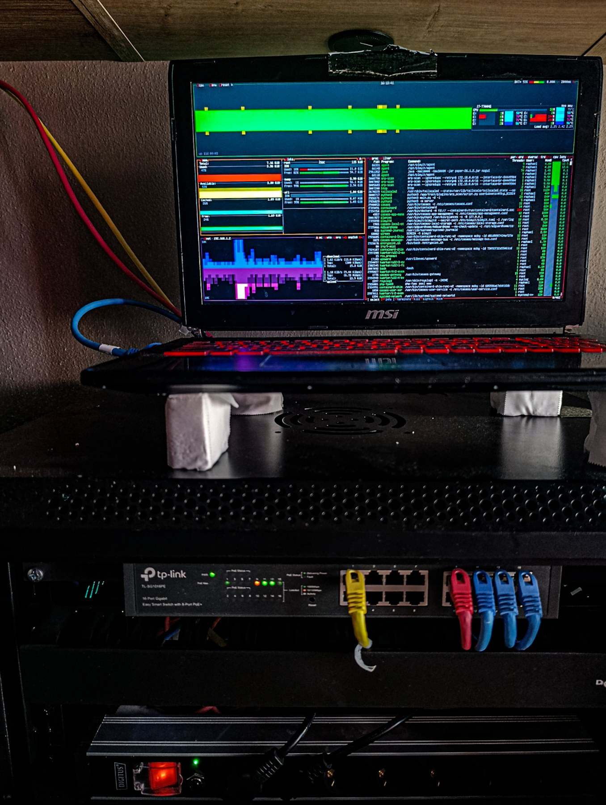
</p>

> *Figure 2: The upcycled MSI Laptop acting as the central server, securely mounted above the 19-inch rack infrastructure, displaying real-time resource monitoring via terminal.*

**System Specifications: MSI GL62M 7REX & External Storage**

| Hardware Component | Specifications / Model | Details & Purpose |
| :--- | :--- | :--- |
| **CPU** | Intel Core i7-7700HQ @ 2.80GHz | 7th Gen (Kaby Lake), 4 Cores / 8 Threads. Provides excellent multi-tasking for concurrent Docker containers. |
| **RAM** | 8GB DDR4 | 1x 8GB installed (1 slot free, upgradeable to 32GB). Sufficient for the current container load. |
| **GPU (Dedicated)** | NVIDIA GeForce GTX 1050 Ti | 2GB GDDR5. Fully active and utilized for Hardware-Accelerated Video Transcoding in Jellyfin, delivering seamless media streaming. |
| **OS Drive (Disk 1)** | 120GB SSD (Kingston RBUSNS8) | M.2 SSD. Houses the Linux OS and the Docker engine for rapid boot times. |
| **Storage Drive (Disk 2)**| 1TB HDD (Seagate ST1000LM048) | 2.5" SATA. Primary internal mass storage for the NAS and media files. |
| **Backup Drive (External)**| 1TB HDD (WD Elements) | USB 3.0 External Drive. Dedicated destination for automated scripts and system backups, ensuring critical data redundancy outside the internal chassis. |
| **Power Supply** | AC Adapter (150W) & Li-Ion Battery | 6-Cell (41 Whr) battery ensuring 100% uptime during short electrical grid fluctuations. |

*(Note: The system is configured to prioritize the dedicated NVIDIA GPU for hardware-accelerated tasks, such as real-time video transcoding, significantly offloading the CPU during high-demand media consumption).*

<a id="33-bare-metal-provisioning-efi-troubleshooting"></a>
### 3.3 Bare-Metal Provisioning & EFI Troubleshooting

To maximize hardware efficiency, a "bare-metal to container" approach was adopted, utilizing **Ubuntu Server 24.04 LTS** as the host operating system. The installation required specific BIOS adjustments and low-level EFI troubleshooting to bypass hardware-specific bugs.

**1. BIOS Optimization**
To prepare the MSI motherboard for a headless Linux environment, the BIOS was configured as follows:
* `Boot Mode`: **UEFI** (Required for modern OS standards).
* `Secure Boot`: **Disabled** (Crucial for allowing third-party Nvidia drivers to compile correctly in Linux).
* `Fast Boot`: **Disabled** (Ensures reliable USB boot prioritization).

**2. The MSI NVRAM Bug & EFI Bypass**
During the initial Ubuntu boot phase, a critical hardware-level error occurred: `import_mok_state() failed: Volume Full`. This is a documented issue with specific MSI motherboards where the NVRAM (Non-Volatile Random-Access Memory) becomes saturated with obsolete Windows logs, preventing the Ubuntu installer from writing MokList security keys.

To resolve this without risking a motherboard brick, the strict bootloader (`shimx64.efi`) was manually bypassed in favor of the standard bootloader (`grubx64.efi`). The system was dropped into a `tty` shell (`Alt+F2`) during the installer failure, and the EFI partition (`sda1`) was patched directly via the terminal:

```bash
# 1. Mount the EFI boot partition of the SSD
sudo mount /dev/sda1 /mnt

# 2. Replace the strict shimx64.efi with the standard grubx64.efi to bypass MokList checks
sudo cp /mnt/EFI/ubuntu/grubx64.efi /mnt/EFI/ubuntu/shimx64.efi

# 3. Unmount and reboot safely
sudo umount /mnt
reboot
```
Following this patch, the system booted flawlessly, and the bare-metal installation was completed on the 120GB SSD.

<a id="34-headless-server-configuration-casaos-deployment"></a>
### 3.4 Headless Server Configuration & CasaOS Deployment

Once the OS was installed, the laptop needed to be converted into a true "Headless Server"—capable of operating 24/7 with the physical lid closed, managed entirely via remote SSH.

**1. Systemd Logind Configuration (Lid Switch Ignore)**
By default, closing a laptop lid triggers a suspend state, halting all server operations. To prevent this, the `systemd-logind` configuration file was modified to ignore lid switch events entirely.

```bash
sudo nano /etc/systemd/logind.conf
```
The following parameters were uncommented and altered to `ignore`:
```ini
HandleLidSwitch=ignore
HandleLidSwitchExternalPower=ignore
HandleLidSwitchDocked=ignore
```
and the last
```ini
LidSwitchIgnoreInhibited=no
```
The daemon was then restarted to apply the changes instantly, allowing the laptop to be closed and racked:
```bash
sudo systemctl restart systemd-logind
```

**2. Automated Security Patching (Zero-Day Vulnerability Mitigation)**
Maintaining an always-on server requires proactive defense against newly discovered vulnerabilities (CVEs). Relying on manual updates introduces human delay, leaving the system temporarily exposed. To mitigate this, the `unattended-upgrades` utility was deployed to autonomously fetch and install critical security patches in the background.

```bash
# Install the automated upgrades utility
sudo apt install unattended-upgrades -y

# Enable and configure the background service
sudo dpkg-reconfigure --priority=low unattended-upgrades
```
*(Note: Executing the reconfigure command opens an interactive terminal UI (ncurses) where "Yes" was selected. This permanently activates the automatic download and installation of stable security updates, ensuring the host OS remains secure without requiring future manual intervention).*

**3. Remote Access (SSH) & Deployment**
With the server physically closed and secured, administration transitioned to a secondary workstation. Initially, the router assigned the server a dynamic DHCP address (`192.168.1.145`). An SSH session was established to access the terminal remotely:
```bash
ssh <SSH_username>@192.168.1.145
```
*(Note: This dynamic IP was strictly temporary for the initial setup phase. The IP was later permanently pinned to `192.168.1.2` via Netplan, as detailed in Section 3.6).*

Through this remote SSH session, **CasaOS**—a lightweight, Docker-based orchestration UI—was deployed using the official installation script:
```bash
curl -fsSL [https://get.casaos.io](https://get.casaos.io) | sudo bash
```
Once CasaOS was active, the secondary 1TB internal HDD (`HDD-1TB`) was formatted to **EXT4** via the CasaOS Web UI, optimizing it for Linux file ownership and container data storage.

<a id="341-openssh-vulnerability-mitigation-ssh-hardening"></a>
### 3.4.1 OpenSSH Vulnerability Mitigation & SSH Hardening

As the server transitioned to a fully headless operating model, SSH became the primary method of remote administration. Securing the service was therefore considered essential for maintaining the overall security of the homelab environment.

During the initial deployment period, a critical OpenSSH vulnerability (**CVE-2024-6387**, publicly known as **regreSSHion**) was disclosed. The vulnerability affected specific OpenSSH versions and could potentially allow remote code execution with elevated privileges under certain conditions. Given that SSH was actively used for server management, immediate mitigation measures were implemented.

Because the server simultaneously operated as the network's primary DNS filtering platform through AdGuard Home, maintenance had to be performed carefully to avoid disrupting internet connectivity for all household devices. Prior to applying updates and rebooting the host, the router's DNS settings were temporarily redirected from the server (`192.168.1.2`) to Cloudflare DNS (`1.1.1.1`).

Once DNS redundancy was established, obsolete packages were removed and the server was rebooted to ensure all updated OpenSSH components were loaded correctly:

```bash
sudo apt autoremove -y
sudo reboot
```

After the host successfully returned online and all critical services were operational, the router's DNS configuration was restored to the server's static address (`192.168.1.2`), reactivating network-wide DNS filtering and advertisement blocking.

To further reduce the attack surface, the OpenSSH daemon configuration was hardened by editing the main configuration file:

```bash
sudo nano /etc/ssh/sshd_config
```

The following directives were enforced:

```ini
PermitRootLogin no
AllowUsers <SSH_username>
```

These settings provide two important security controls:

- Direct SSH authentication as the `root` user is completely disabled.
- Remote access is restricted exclusively to the designated administrative account (`<SSH_username>`).

After saving the configuration, the SSH daemon was restarted to apply the new access-control policy:

```bash
sudo systemctl restart ssh
```

This hardening procedure significantly reduced the risk of unauthorized access, brute-force attacks, and privilege-escalation attempts while ensuring secure long-term remote administration of the server.

<a id="35-repository-server-directory-structure"></a>
### 3.5 Repository & Server Directory Structure

To maintain organization and ensure the infrastructure is easily reproducible, the repository and server configuration files are structured as follows:

```text
Laptop-Home-Server/
├── docker-compose/              # 🐳 Server-side Docker Compose files for deployments
│   ├── adguard-home/            # DNS security configuration
│   ├── jellyfin/                # Media server volume mappings
│   ├── crafty-controller/       # Minecraft server management configs
│   └── netalertx/               # Network monitoring setup
├── scripts/                     # ⚙️ Custom automation & maintenance scripts
│   └── auto_backup.sh           # Script syncing NAS data to the 1TB WD Elements
├── images/                      # 🖼️ Assets for GitHub documentation
│   ├── physical_server1.jpg     # Physical rack setup (Angle 1)
│   ├── physical_server2.jpg     # Physical rack setup (Angle 2)
│   ├── casaos_dashboard.png
│   ├── topology_Diagram.drawio
│   ├── topology_Diagram.png
│   └── topology_Diagram_with_grid.png
├── .gitattributes               # Git configuration
├── LICENSE                      # Open Source License
└── README.md                    # This master documentation file
```

<a id="36-host-network-configuration-os-level-hardening"></a>
### 3.6 Host Network Configuration & OS-Level Hardening

To ensure absolute network stability, redundancy, and maximum security against local or external threat vectors, the server's network interfaces (Ethernet and Wi-Fi) were statically configured directly via **Netplan**. Relying on dynamic addressing (DHCP) for core infrastructure introduces unnecessary attack surfaces and vulnerabilities.

**1. Static IP & Netplan Deployment (DHCP Spoofing Mitigation)**
By explicitly disabling DHCP (`dhcp4: no`) and hardcoding the IP addresses at the kernel level, the server is immunized against Rogue DHCP server attacks and IP spoofing. The setup was executed step-by-step in the terminal:

* First, the exact name of the network interface (e.g., `enp3s0`) was identified:
    ```bash
    ip a
    ```
* The configuration file was located and edited (Nano shortcuts `Ctrl + \`, `^.*`, and `A` were utilized to rapidly clear default boilerplate text):
    ```bash
    ls /etc/netplan/
    sudo nano /etc/netplan/00-installer-config.yaml
    ```
* The YAML file was fully restructured to enforce the static IPs (`192.168.1.2` for Ethernet and `192.168.1.3` for Wi-Fi) and a specific DNS hierarchy:
    ```
      network:
        version: 2
        ethernets:
          enp3s0:
            addresses:
            - 192.168.1.2/24
            dhcp4: false
            dhcp6: false
            match:
              macaddress: ##:##:##:##:##:##
            nameservers:
              addresses:
              - 9.9.9.9
              - 149.112.112.112
              - 1.1.1.1
              - 1.0.0.1
              - 8.8.8.8
              - 8.8.4.4
              - 192.168.1.1
              search: []
            routes:
            - to: default
              via: 192.168.1.1
              metric: 100
            set-name: enp3s0
        wifis:
          wlp2s0:
            access-points:
              WIFI-SSID:
                password: "WIFI-PASSWORD"
            dhcp4: false
            dhcp6: false
            addresses:
            - 192.168.1.3/24
            routes:
            - to: default
              via: 192.168.1.1
              metric: 200
            nameservers:
              addresses:
              - 9.9.9.9
              - 149.112.112.112
              - 1.1.1.1
              - 1.0.0.1
              - 192.168.1.1
    ```
* The configuration was saved (`Ctrl+O`, `Enter`, `Ctrl+X`) and applied directly to the host:
    ```bash
    sudo netplan apply
    ```

**2. DNS Prioritization Strategy (Anti-DNS Hijacking)**
Hardcoding DNS resolvers directly into Netplan prevents malicious actors or compromised local routers from injecting poisoned DNS entries (DNS Hijacking) via DHCP broadcasts. The `nameservers` block reflects a highly robust failover strategy prioritizing network security:
1.  **Quad9 (`9.9.9.9`, `149.112.112.112`):** Set as the primary resolver. Selected for its built-in Cyber Threat Intelligence that blocks malware, botnets, and phishing domains at the routing level before they can load.
2.  **Cloudflare (`1.1.1.1`, `1.0.0.1`):** Set as the primary fallback. Functions as an ultra-fast, raw DNS resolver (often sub-5ms latency) providing maximum speed redundancy.
3.  **Google DNS (`8.8.8.8`, `8.8.4.4`):** Set as the tertiary fallback to guarantee 100% uptime.
4.  **Local Gateway (`192.168.1.1`):** The absolute last resort.

**3. Network Validation & Tailscale Integration (Zero-Trust Overlay)**
To guarantee the host OS was resolving traffic correctly through the intended DNS tunnel, extensive terminal-based validations were executed:

* Checking the active DNS hierarchy natively via `systemd-networkd` and `systemd-resolved`:
    ```bash
    networkctl status
    resolvectl status
    ```
* Running live resolution tests and packet loss checks:
    ```bash
    nslookup google.com
    dig google.com
    ping -c 3 google.com
    ```
* **Zero-Trust Mesh Validation:** The integrity of the encrypted Tailscale overlay was verified directly via the native Tailscale CLI, rather than relying on local DNS stubs. These commands confirm that the node is successfully authenticated, peer-to-peer UDP hole punching is functioning, and the encrypted tunnel is actively shielding traffic from the physical LAN:
    ```bash
    # Verify active peer connections and node health within the Tailnet
    tailscale status

    # Evaluate latency, UDP packet flow, and routing paths to the DERP relays
    tailscale netcheck
    ```
* *Note on Tailscale MagicDNS:* During active SSH sessions over the Tailscale VPN, executing `cat /etc/resolv.conf` displays `nameserver 100.100.100.100`. This is highly intentional; Tailscale's MagicDNS acts as a secure, encrypted Zero-Trust overlay. It resolves local mesh hostnames (e.g., `rafailpc`) while automatically forwarding external WAN queries out to the Netplan-defined Quad9/Cloudflare servers. This architecture shields internal DNS queries from the physical LAN, neutralizing eavesdropping or lateral movement attempts from untrusted local network devices.

**4. Wireless Interface Hardening (Dark Standby)**
Although the Wi-Fi interface (`wlp2s0`) was fully configured in Netplan with a static IP (`192.168.1.3/24`) and an identical DNS failover array as the Ethernet, the wireless radio was intentionally **disabled** at the OS level. 
* **Security & Stability Justification:** Leaving an active Wi-Fi connection running concurrently with Gigabit Ethernet on a server creates an unnecessary wireless attack surface (making it vulnerable to Deauth attacks or Rogue APs) and can lead to asynchronous routing issues where the OS accidentally routes traffic through the slower Wi-Fi metric. By fully configuring it but disabling the physical radio, it acts as a "Dark Standby"—ready to be instantly enabled without configuration only if the physical Ethernet port fails.
* **Execution:** The wireless transmitter was killed at the kernel level using the `rfkill` utility, ensuring only the Ethernet interface (`enp3s0`) handles traffic:
    ```bash
    # Block all Wi-Fi transmissions at the OS level
    sudo rfkill block wifi

    # Verify the radio is completely disabled (Soft blocked: yes)
    rfkill list wifi

    # Confirm the interface is down
    ip link show wlp2s0
    ```

<a id="4-services-analysis-implementation-troubleshooting"></a>
## 4. Services Analysis (Implementation & Troubleshooting)

This section delves into the core software services that transform the physical hardware into a fully functional, self-hosted cloud environment. 

To achieve maximum stability and modularity, a strict **Container-First** philosophy was adopted. Instead of installing software directly onto the host operating system, every service is deployed as an isolated **Docker Container** and managed through the **CasaOS** interface. 

This architectural choice provides several critical advantages for a homelab environment:
* **Isolation & Stability:** Applications run in their own secure environments with bundled dependencies. If one service encounters an error or crashes, the host operating system and other running containers remain completely unaffected.
* **Persistent Data Management:** Configuration files and user data are mapped to specific directories on the physical storage drives (Docker Volumes). This ensures that containers can be safely updated, wiped, or recreated without any data loss.
* **Portability & Maintenance:** The entire infrastructure is reproducible. Updating a service is as simple as pulling the latest Docker image, minimizing downtime and maintenance overhead.

In the following subsections, each core service is analyzed individually. The documentation covers the specific **Implementation** strategy (deployment logic, network configurations, and family use cases) along with the **Troubleshooting** steps taken to overcome technical hurdles during the initial setup process.

<a id="41-adguard-home-quad9-doh-security-server"></a>
### 4.1 AdGuard Home & Quad9 DoH (Security Server)

The foundation of the homelab's network security is **AdGuard Home**, acting as a network-wide DNS sinkhole. By pointing the ISP router's primary DHCP DNS settings to the laptop server's IP (`192.168.1.2`), every device connected to the network—from desktop PCs and smartphones to the LG WebOS Smart TV—automatically routes its DNS queries through this container. This eliminates the need to install individual ad-blockers on separate client devices.

<p align="center">
  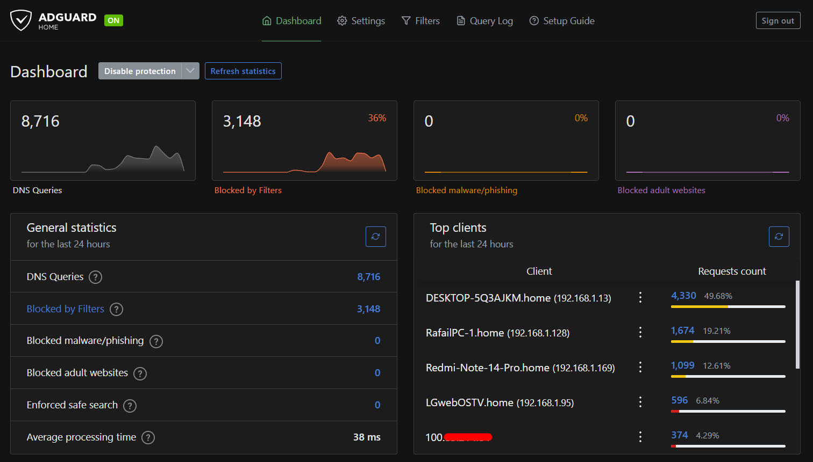
  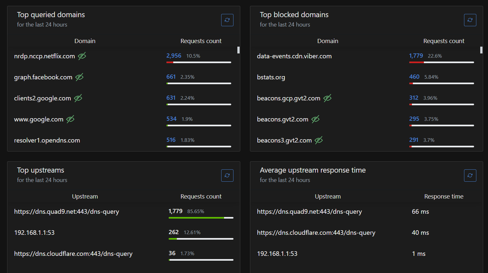
</p>

> *Figure 4: The AdGuard Home Dashboard showcasing real-time statistics, upstream response times, and active Tailscale VPN clients (`100.x.x.x`).*

**1. Docker Deployment via CasaOS**
The service is deployed using the official `adguard/adguardhome:v0.107.76` image running on a `bridge` network. To ensure stability and avoid port conflicts, the container is meticulously configured:
* **Port Mappings:** The standard DNS port `53` (TCP/UDP) is exposed directly to the host to accept local network queries. The Web UI is mapped to port `3001` (Host) -> `80` (Container) to prevent overlap with other web services. Ports `853` and `784` are also exposed for DNS-over-TLS and DNS-over-QUIC capabilities.
* **Persistent Volumes:** Critical configuration and working directories are mapped to `/DATA/AppData/adguard-home/conf` and `/opt/adguardhome/work`. This ensures that custom filters, logs, and statistical data (set to a 90-day log retention and 24-hour active statistic retention) survive container reboots and image updates.
* **Resource Allocation:** The container is set to "High" CPU shares with an "unless-stopped" restart policy, guaranteeing maximum availability as a critical network component.

**2. Upstream DNS, Privacy & Redundancy**
A primary goal of this homelab is ISP independence and absolute data privacy. Standard DNS queries are sent in plain text, making them visible to Internet Service Providers. To solve this, AdGuard Home is configured to use **DNS-over-HTTPS (DoH)** with a highly redundant architecture:
* **Primary Upstream:** All outbound queries are encrypted and routed to `https://dns.quad9.net/dns-query` (Quad9). Quad9 was selected for its strict privacy policies and built-in threat intelligence against malware domains.
* **Fallback Strategy:** To ensure zero network downtime in the event of a Quad9 outage, `https://dns.cloudflare.com/dns-query` is configured as a dedicated Fallback DNS server. 
* **Bootstrap DNS Resolvers:** To prevent the "chicken-and-egg" problem of resolving the DoH server hostnames (`dns.quad9.net` and `dns.cloudflare.com`) before encrypted DNS is established, reliable Bootstrap IPs are defined (`9.9.9.9`, `149.112.112.112`, and IPv6 equivalents).
* **Routing Strategy:** The "Parallel Requests" load-balancing algorithm is enabled. AdGuard queries all configured upstreams simultaneously and uses the fastest response, dramatically reducing DNS resolution times.
* **DNSSEC Enforced:** Domain Name System Security Extensions (DNSSEC) is strictly enforced to prevent DNS spoofing and cache-poisoning attacks.

**3. Comprehensive Filtering Architecture**
The filtering engine is highly customized, successfully intercepting and neutralizing approximately **28% of all network traffic** at the DNS level. The blocklist matrix relies on a combination of community-driven lists (updated automatically every 12 hours) and native security features:

<p align="center">
  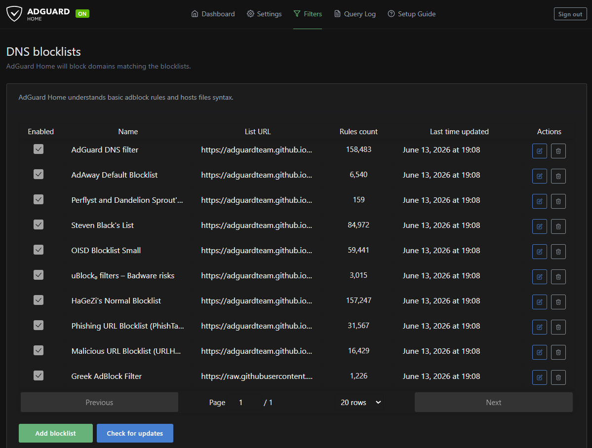
</p>

> *Figure 5: The active DNS blocklists, strategically selected to neutralize ads, trackers, and malware without breaking core web functionality.*

* **General Ad & Tracker Blocking:**
  * **AdGuard DNS Filter:** The core filter, optimized specifically for DNS-level blocking of ads and trackers.
  * **OISD Blocklist Small:** A highly curated, "set-and-forget" list that aggressively blocks ads and telemetry with virtually zero false positives.
  * **HaGeZi's Normal Blocklist:** An excellent, balanced list targeting advertising, tracking, and metrics domains, designed to clean up the internet experience without breaking legitimate web functionality.
  * **AdAway Default Blocklist:** A mobile-focused blocklist, crucial for stopping in-app advertisements and analytics tracking on family smartphones and tablets.
  * **Steven Black's List:** A legendary, consolidated hosts file that blocks a massive array of adware and malware domains.

* **Specialized & Regional Filtering:**
  * **Perflyst and Dandelion Sprout's Smart-TV Blocklist:** Specifically chosen to combat the aggressive telemetry and built-in advertising found in modern Smart TVs (like the household's LG WebOS TV).
  * **Greek AdBlock Filter:** A regional blocklist tailored to eliminate local advertisements and trackers specific to the Greek webspace.

* **Malware, Phishing & Content Protection:**
  * **uBlock filters – Badware risks:** Blocks domains known to host or distribute badware/malware.
  * **Phishing URL Blocklist (PhishTank):** Intercepts requests to known phishing sites aiming to steal credentials.
  * **Malicious URL Blocklist (URLHaus):** Blocks domains associated with malware distribution and botnet command-and-control servers.
  * **AdGuard Browsing Security Web Service:** Actively enabled. AdGuard checks domain hashes against a real-time, privacy-friendly API to block zero-day malicious domains before the static lists can update.
  * **Enforced Safe Search:** To ensure a family-friendly environment, Safe Search is strictly enforced at the network level across all major search engines (Google, Bing, DuckDuckGo, YouTube, Yandex, etc.), preventing explicit content from appearing in search results.

**4. Local Network Resolution (Reverse DNS)**
A common issue in containerized DNS servers is that client requests appear to originate from the Docker gateway or present as raw IP addresses, making monitoring difficult. This was resolved by enabling **Private Reverse DNS Resolvers**. 
By pointing the reverse DNS resolver directly to the ISP Router (`192.168.1.1`), AdGuard successfully performs Reverse Resolving of clients' IP addresses. This allows the dashboard to correctly identify internal hostnames (e.g., `LGwebOSTV.home` or `DESKTOP-5Q3AJKM.home`), as well as external devices tunneling in via the Tailscale VPN subnet (`100.x.x.x`).

**5. Performance Optimization**
To further enhance network speed, **Optimistic Caching** is enabled alongside a 4MB dedicated DNS cache. This allows the server to serve expired cache entries instantly to the user while silently refreshing the domain TTL in the background, making web browsing feel instantaneous for the entire household.

#### Troubleshooting & Network Conflicts
During the initial deployment and stabilization phase, several core networking conflicts were identified and resolved to ensure seamless operation:

* **Port 53 Allocation Conflict:** The host operating system (Ubuntu) had port `53` bound to the internal `systemd-resolved` daemon, preventing the Docker container from listening for DNS queries. The daemon was permanently disabled via the terminal (`sudo systemctl disable systemd-resolved`), and the CasaOS mapping was corrected to route Host port `53` directly to Container port `53`.
* **Host DNS Resolution Failure:** Disabling the default DNS stub left the bare-metal OS without internet resolution capabilities (`DNS_PROBE_POSSIBLE`). This was fixed by manually overriding the `/etc/resolv.conf` file to point the host's nameserver directly to `127.0.0.1` (the local container).
* **Web UI Port Mismatch:** Following the setup wizard, the container's internal web server automatically migrated from port `3000` to port `80`, resulting in a "Connection Refused" error. The CasaOS configuration was updated to map Host port `3001` to Container port `80`, restoring dashboard access.
* **The IPv6 Bypass Leak:** Windows client devices were bypassing the AdGuard sinkhole by prioritizing IPv6 DNS addresses automatically provided by the ISP Router. This leak was plugged by disabling IPv6 on the client network adapters and enforcing the "Disable resolving of IPv6 addresses" rule within AdGuard, forcing all traffic through the controlled IPv4 tunnel.
* **Browser-Level DoH Conflicts:** Client browsers with "Secure DNS" enabled internally (e.g., Chromium browsers routing to Cloudflare) were bypassing the local network entirely. This was resolved by disabling browser-level secure DNS, thereby centralizing the DoH encryption process at the AdGuard server level to achieve both privacy and network-wide ad-blocking.
* **Reverse DNS Anomalies:** Public IPs (such as Google's `8.8.8.8`) were polluting the local query logs because AdGuard defaulted to public servers for internal Reverse DNS lookups. This was rectified by explicitly assigning the ISP Router (`192.168.1.1`) as the sole Private Reverse DNS resolver, ensuring accurate identification of local hostnames.
* **Upstream Latency Spikes:** Initial configurations relying on a single upstream provider (Cloudflare) via Load-Balancing resulted in sluggish response times (~199ms). Introducing Quad9 as an additional upstream and switching to a "Parallel requests" algorithm drastically reduced average lookup times to ~42ms.

<a id="42-file-server-automations-backup-strategy-nas"></a>
### 4.2 File Server, Automations & Backup Strategy (NAS)

The file management architecture transcends a simple Network Attached Storage (NAS) setup, functioning as a fully automated, **Zero Trust Private Cloud**. It ensures strict user isolation, automated data lifecycle management, and a robust backup strategy utilizing an external 1TB USB 3.0 drive.

**1. File System & Storage Preparation**
While Linux natively supports NTFS, the external 1TB backup drive (`EXTERNAL_HDD_1TB`) was deliberately formatted to **EXT4** directly via the CasaOS Storage Manager. NTFS lacks native support for Linux file ownership and permissions, which could cause critical access errors for background services and Cron jobs. EXT4 guarantees maximum throughput, stability, and absolute compatibility with the Linux ecosystem.

<p align="center">
  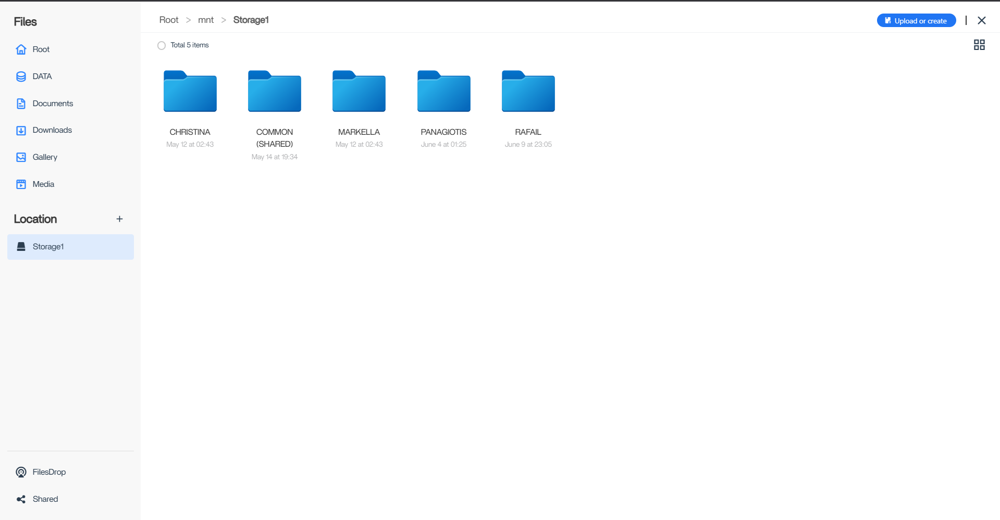
</p>

> *Figure 6: The CasaOS interface displaying the internal storage structure and the isolated `BACKUP FILES` directory.*

**2. Access Control & Samba Configuration (Zero Trust Local Access)**
To enforce strict privacy among family members, the default CasaOS UI sharing mechanisms were bypassed. Relying on the GUI caused hierarchy conflicts (sharing a parent directory automatically unshared child directories). Instead, access was hardcoded at the OS OSI Layer 7 level via the `/etc/samba/smb.conf` file.

* **System-Level User Security:** To protect the server from Local Privilege Escalation exploits (such as Linux kernel Use-After-Free CVE-2026-23111), the family members were added as system users explicitly without home directories and without shell access. This ensures they can authenticate to the SMB share but cannot open an SSH terminal or execute malicious code. The following commands were executed:
  ```bash
  sudo useradd -M -s /sbin/nologin raphael
  sudo useradd -M -s /sbin/nologin christina
  sudo useradd -M -s /sbin/nologin markella
  sudo useradd -M -s /sbin/nologin panagiotis
  ```

* **Credential Management:** Passwords for all users (including the admin) were independently set directly into the Samba database, ensuring credentials remain strictly encrypted:
  ```bash
  sudo smbpasswd -a <password> //for raphael
  sudo smbpasswd -a <password> //for christina
  sudo smbpasswd -a <password> //for markella
  sudo smbpasswd -a <password> //for panagiotis
  ```

* **OS-Level Ownership & Group Management (Linux vs. Samba Integration):** To ensure the underlying EXT4 file system respects the Samba network policies, explicit directory ownership had to be assigned. A shared group was created for the common directory, while personal directories were strictly chowned to their respective users to prevent read-only lockouts:

  ```bash
  # Create a unified group for the shared directory
  sudo groupadd family_share
  sudo usermod -aG family_share raphael
  sudo usermod -aG family_share christina
  sudo usermod -aG family_share markella
  sudo usermod -aG family_share panagiotis

  # Assign absolute ownership of personal directories to individual users
  sudo chown -R raphael:raphael /mnt/HDD-1TB/RAFAIL
  sudo chown -R christina:christina /mnt/HDD-1TB/CHRISTINA
  sudo chown -R markella:markella /mnt/HDD-1TB/MARKELLA
  sudo chown -R panagiotis:panagiotis /mnt/HDD-1TB/PANAGIOTIS

  # Assign group ownership and read/write/execute permissions to the common directory
  sudo chown -R root:family_share "/mnt/HDD-1TB/COMMON (SHARED)"
  sudo 
  ```
 
* **Samba Isolation (The Configuration File):** The main Samba configuration file was opened via the terminal:
  ```bash
  sudo nano /etc/samba/smb.conf
  ```
  At the very end of the file, strict access rules were appended. Personal directories were locked behind the valid users directive, while the COMMON directory utilized force group and specific permission masks to guarantee inherited write privileges for all family members:
  ```ini
  [COMMON]
     path = /mnt/HDD-1TB/COMMON (SHARED)
     browsable = yes
     writable = yes
     valid users = raphael, christina, markella, panagiotis
     force group = family_share
     create mask = 0775
     directory mask = 0775

  [RAFAIL]
     path = /mnt/HDD-1TB/RAFAIL
     browsable = yes
     writable = yes
     valid users = raphael

  [CHRISTINA]
     path = /mnt/HDD-1TB/CHRISTINA
     browsable = yes
     writable = yes
     valid users = christina

  [MARKELLA]
    path = /mnt/HDD-1TB/MARKELLA
    browsable = yes
    writable = yes
    valid users = markella

  [PANAGIOTIS]
    path = /mnt/HDD-1TB/PANAGIOTIS
    browsable = yes
    writable = yes
    valid users = panagiotis
  ```
  After saving the file (`Ctrl+O`, `Enter`, `Ctrl+X`), the Samba service was restarted to apply the new architecture:
  ```bash
  sudo systemctl restart smbd
  ```

<p align="center">
  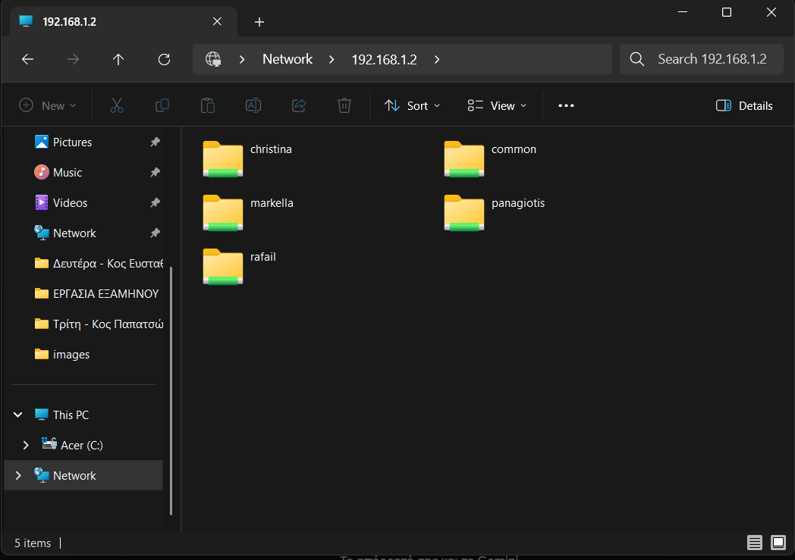
  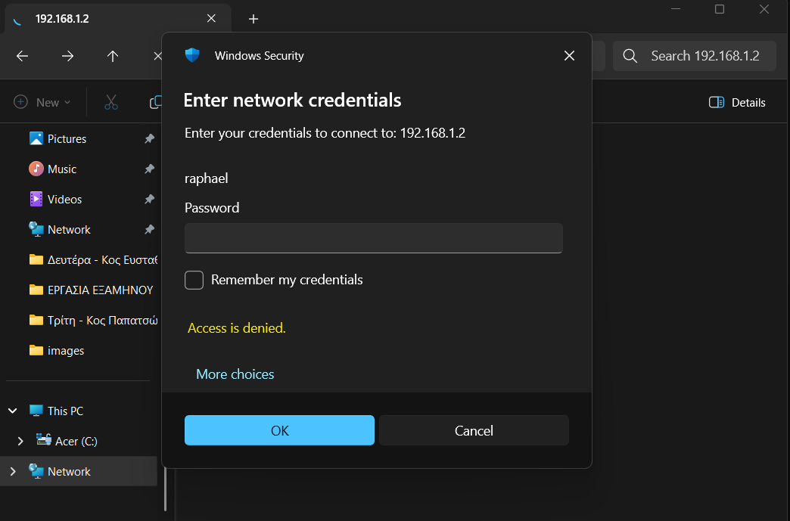
</p>

> *Figure 7: The strict, user-isolated Samba directory structure alongside the Windows Network Credentials prompt enforcing secure, authenticated access.*

**3. Data Lifecycle Automations (Cron Jobs)**
To prevent storage exhaustion and ensure data redundancy, the system relies on carefully scheduled Cron jobs, split between the Root and User crontabs. The scheduling utilizes the "Maintenance Window" (04:00 - 06:00 AM) to avoid network congestion.

* **System Cleanup (Root Crontab):** To clear obsolete packages and keep the OS SSD lightweight, the root crontab was accessed:
  ```bash
  sudo crontab -e
  ```
  The following job was added to run every Sunday at 04:30 AM:
  ```bash
  30 4 * * 0 apt-get autoremove -y && apt-get clean
  ```

* **File Automations & Backups (User Crontab):** To manage the data lifecycle, the standard user crontab was accessed:
  ```bash
  crontab -e
  ```
  The following three jobs were added to handle the Smart Trash and Backup processes:
  ```bash
  # 1. Smart Trash: Deletes files in COMMON older than 30 days (Daily at 05:00 AM)
  0 5 * * * find "/mnt/HDD-1TB/COMMON (SHARED)/" -mindepth 1 -mtime +30 -delete
  
  # 2. Weekly Backup: Archives data to external drive without deleting old files (Sundays at 04:00 AM)
  0 4 * * 0 rsync -av /mnt/HDD-1TB/ "/mnt/EXTERNAL_HDD_1TB/BACKUP FILES/"
  
  # 3. Backup Purge: Deletes files in the BACKUP's COMMON folder older than 90 days (Daily at 06:00 AM)
  0 6 * * * find "/mnt/EXTERNAL_HDD_1TB/BACKUP FILES/COMMON (SHARED)/" -mindepth 1 -mtime +90 -delete
  ```

**4. Dual Access Strategy (Smart Routing)**
Accessing the server files is optimized through a Split Tunneling approach. Local machines feature two distinct network shortcuts:

<p align="center">
  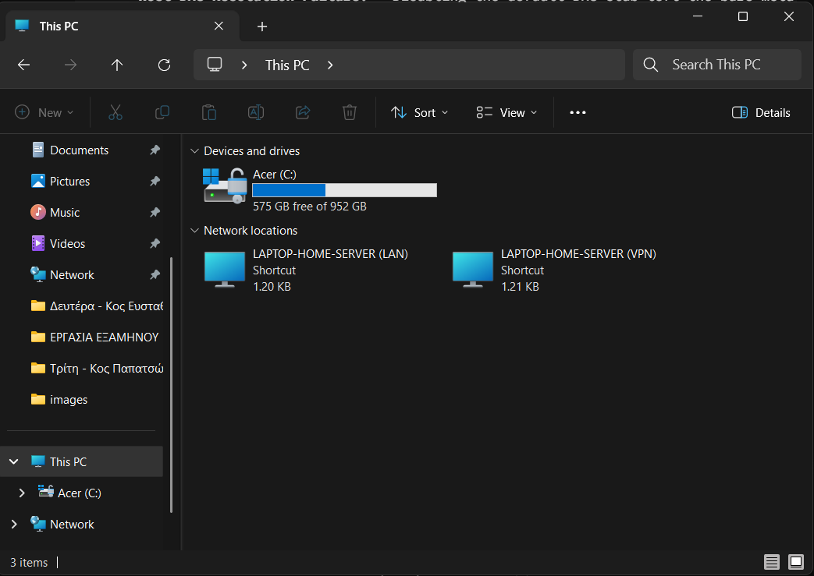
</p>

> *Figure 8: Smart routing execution via dedicated Windows shortcuts separating Local Area Network (LAN) traffic from encrypted Virtual Private Network (VPN) traffic.*

* **LAN Shortcut (`\\192.168.1.2`):** Bypasses the VPN entirely to achieve raw 1000 Mbps Gigabit speeds when physically at home.
* **VPN Shortcut (`\\100.x.x.x`):** Routes via the Tailscale WireGuard tunnel, offering encrypted, Zero-Trust access to the files from anywhere in the world, even on untrusted public Wi-Fi.

#### Troubleshooting & Problem Resolution
* **Physical Layer Packet Loss (VPN Instability):** The Tailscale VPN experienced frequent, random disconnects. Diagnosis revealed the TP-Link switch port indicator was Orange (10/100Mbps) instead of Green (1000Mbps). A physical contact issue in the Cat6a ethernet cable pins caused the auto-negotiation to drop to 100Mbps, resulting in micro-packet loss. While basic web browsing masked the packet loss via retransmissions, the strict WireGuard encrypted tunnel collapsed. Reseating the cable restored the Gigabit link and permanently stabilized the VPN.
* **Windows SMB Caching ("This folder is empty" error):** When adjusting folder sharing through the CasaOS UI, the Samba daemon hierarchy broke. Even after manual `smb.conf` deployment, Windows client machines displayed an empty network drive. This was resolved by forcing Windows to flush its SMB cache by deleting all existing server entries in the Windows Credential Manager, executing an "Unshare" action in the CasaOS UI, and issuing `sudo systemctl restart smbd`.
* **Cron `-mtime` Logic Misinterpretation & Linux Case-Sensitivity:** An initial assumption was made that the 30-day purge script had failed because a file (`word.zip`) remained in the COMMON folder. Debugging commenced by verifying the exact file name using `ls -lh "/mnt/HDD-1TB/COMMON (SHARED)/"` (to account for strict Linux case-sensitivity). Using the `stat "/mnt/HDD-1TB/COMMON (SHARED)/word.zip"` command in the terminal revealed the file's `Modify` timestamp was exactly 24 days old. A subsequent dry run using `find ... -mtime +30` (without the `-delete` flag) confirmed the script was executing flawlessly, correctly ignoring files that had not strictly crossed the 30-day threshold.
* **Samba vs. Linux File Permissions Conflict (Read-Only Error):** Initially, non-admin users successfully authenticated into the Samba shares but were denied write/modify access (e.g., unable to transfer or delete files). Diagnosis revealed a critical desynchronization between the Network Layer permissions (Samba) and the OS Layer permissions (EXT4). While `smb.conf` permitted network entry, the underlying physical Linux directories were still owned by the `root` user, overriding network rules. The issue was permanently resolved by creating a dedicated `family_share` group, applying strict `chown -R` ownership rules to map physical directories to their specific owners, and injecting `force group` and `0775` permission masks within the `smb.conf` file to sync Linux rules with Samba network policies.

<a id="43-tailscale-mesh-vpn"></a>
### 4.3 Tailscale (Mesh VPN)

To securely manage the homelab remotely and bypass Carrier-Grade NAT (CGNAT) without exposing vulnerable ports to the public internet, **Tailscale** (a WireGuard-based Mesh VPN) was implemented. This setup provides a Zero-Trust Network Access (ZTNA) overlay, allowing end-to-end encrypted peer-to-peer (P2P) connections globally.

#### 1. Containerization Failure & Bare-Metal Pivot
The initial deployment strategy involved running Tailscale as a Docker container via the CasaOS App Store (using the `big-bear-tailscale` image). However, this introduced severe instability. 

* **Diagnostics & Troubleshooting:** The container failed to provide the authentication link, entering a continuous restart loop (`exit status 1`, `logger closing down`). Forcing the container to execute the authentication command directly via `sudo docker exec -it big-bear-tailscale tailscale up` revealed persistent timeout errors caused by Docker's internal networking restrictions.
* **Resolution:** To ensure absolute stability and system-level network control, the container was forcefully stopped and permanently uninstalled. Tailscale was deployed directly onto the **bare-metal Ubuntu Host OS** using the official installation script:
```bash
  curl -fsSL [https://tailscale.com/install.sh](https://tailscale.com/install.sh) | sh
  sudo tailscale up
  ```
Once authenticated via the browser, the server was assigned a permanent static VPN IP (`100.X.X.X`), verified by executing:
```bash
  tailscale ip -4
  ```

#### 2. OS-Level IP Forwarding (Kernel Configuration)
For the server to function as a central network gateway, it required explicit kernel-level permission to forward IPv4 and IPv6 traffic. The `sysctl` rules were appended and instantly applied via the terminal:
```bash
echo 'net.ipv4.ip_forward = 1' | sudo tee -a /etc/sysctl.d/99-tailscale.conf
echo 'net.ipv6.conf.all.forwarding = 1' | sudo tee -a /etc/sysctl.d/99-tailscale.conf
sudo sysctl -p /etc/sysctl.d/99-tailscale.conf
```

#### 3. Subnet Routing, Exit Node Architecture & Device Sharing
To achieve complete remote dominance over the entire physical network and securely onboard family members, the server was elevated to a **Subnet Router** and **Exit Node**.

* **Subnet Routing (Emergency Router Management):** By default, Tailscale only connects devices actively running the application. The primary motivation for deploying a Subnet Router was to establish secure, emergency remote management capabilities for the Cosmote ISP Router (`192.168.1.1`). By bridging the VPN tunnel with the physical LAN (`192.168.1.0/24`), complete administrative access to the home router (and any other general non-Tailscale local devices) is maintained from any remote location, effectively eliminating the need to expose dangerous public-facing web management ports.
* **The Execution:** The node was instructed to advertise the local IP range (`192.168.1.0/24`) and its Exit Node capabilities simultaneously using the following command:
```bash
  sudo tailscale up --advertise-routes=192.168.1.0/24 --advertise-exit-node
  ```
  *(Note: The terminal returned a `warning: UDP GRO forwarding is suboptimally configured` message. This is a known performance tuning notice regarding the Linux network adapter and does not indicate an error or impede functionality).*
* **Dashboard Approval:** Within the Tailscale Admin Console, both the Subnet Route (`192.168.1.0/24`) and Exit Node toggles were manually approved under the machine's "Edit route settings". Remote client machines (e.g., Windows laptops) were configured to "Use Tailscale subnets" to successfully route local traffic through the tunnel.

<p align="center">
  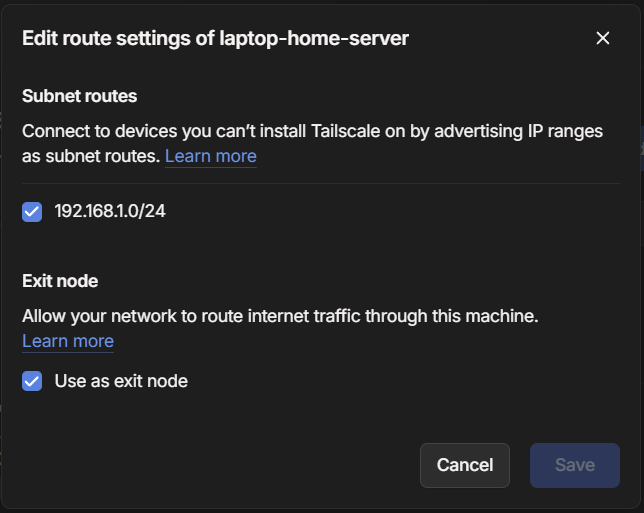
</p>

> *Figure 9: Approving the advertised Subnet routes and Exit Node capabilities within the Tailscale Admin Console to enable LAN bridging.*

* **Node Sharing (Principle of Least Privilege):** While all core network devices (`laptop-home-server`, `rafailpc`, `redmi-note-14-pro`) are securely grouped under the primary owner's account (`rafasliakos...`), access had to be granted to a family member. Instead of sharing the master account credentials, Tailscale's "Node Sharing" feature was utilized. The server node was explicitly shared with the brother's email address (`sibling@example.com`). This securely grants him direct access to the server's self-hosted services without exposing the entire underlying physical network or granting access to the owner's personal client devices.

<p align="center">
  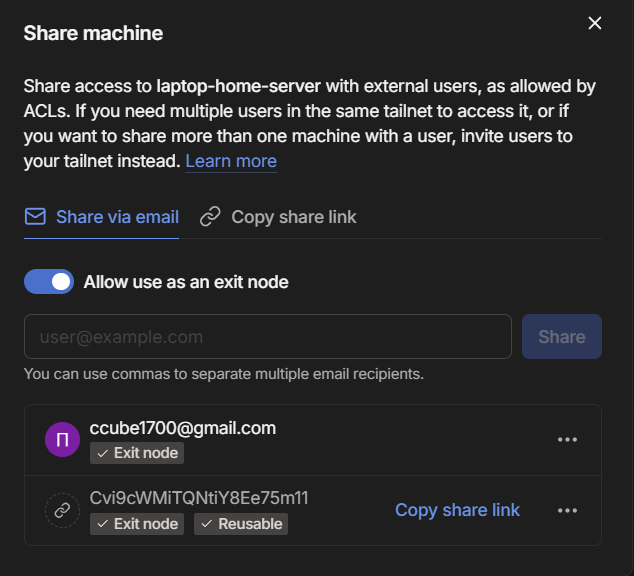
</p>

> *Figure 10: Utilizing Tailscale's Node Sharing feature to grant isolated access to a specific family member without exposing the entire Tailnet.*

#### 4. Global DNS Override & AdGuard Integration (The "Magic Trick")
A highly advanced Split-Tunneling and DNS overriding architecture was configured to ensure Ad-Blocking operates globally, even when the Exit Node routing is intentionally disabled for latency-sensitive tasks (like online gaming).

* **Tailscale DNS Configuration:** In the Tailscale Admin Console, the server's VPN IP (`100.X.X.X`) was added as a Custom Global Nameserver, and the **"Override local DNS"** toggle was activated.
* **The "Magic Trick" Logic:** When a remote device sets the Exit Node to `None`, its heavy traffic (downloads, streaming) utilizes the direct local Wi-Fi to achieve maximum speed. However, due to the DNS Override, the microscopic DNS queries are routed via the Tailscale tunnel (`100.100.100.100` MagicDNS routes to `100.X.X.X`) directly to the home AdGuard container. This hybrid approach guarantees network-wide ad-blocking and Quad9 DoH malware protection with zero bandwidth throttling.

#### 5. Resolving IPv6 DNS Leaks
During local testing, a DNS leak was identified: Windows client devices were bypassing the AdGuard sinkhole by querying the ISP's (Cosmote) default IPv6 DNS servers.
* **The Fix:** IPv6 was disabled on the physical network adapters of local Windows clients, forcing 100% of LAN traffic through the IPv4 AdGuard sinkhole.
* **AdGuard Configuration:** Crucially, inside the AdGuard settings, the **"Disable resolving of IPv6 addresses"** option was left **unchecked**. This allows Tailscale's internal IPv6 stack (`fd7a:...`) to seamlessly query AdGuard for AAAA records when operating remotely, ensuring maximum P2P traversal speed.

#### 6. Network Validation & Performance Analysis
To validate the integrity of the Zero-Trust mesh and the routing speed, exhaustive terminal tests were conducted from a remote laptop connected to a public Wi-Fi network:

* **Direct Peer-to-Peer Verification (Tailscale Ping):**
  Executing `tailscale ping 100.X.X.X` yielded:
  `pong from laptop-home-server (100.X.X.X) via [2a02:587:...]:41641 in 6ms`
  *Analysis:* The `via` parameter confirmed the connection was entirely direct (P2P), completely bypassing slower DERP relays. It utilized the server's public Cosmote IPv6 address via UDP port `41641`, achieving an astonishingly low latency of **6ms to 19ms** across cities.
* **Encapsulation & Firewall Testing (Tracert):**
  Executing a `tracert` to the Tailscale IP (`100.X.X.X`) showed a single (1) hop, proving full WireGuard encapsulation. Conversely, executing a `tracert` directly to the server's public IPv6 address revealed the ISP's routing nodes until it reached the home router, where it correctly timed out (`* * * Request timed out`). This confirmed the home firewall is impenetrable to public ICMP requests, yet completely accessible via the authenticated Tailscale tunnel.
* **VPN Overhead & Bandwidth Validation (Speedtest):**
  * **With Exit Node Active:** A remote speed test yielded ~106 Mbps / 32 Mbps. The ISP was correctly identified as **Cosmote**, proving the public network was completely bypassed and the connection securely terminated at the home 1000/500 Mbps FTTH connection.
  * **With Exit Node Disabled:** A subsequent test yielded 154 Mbps / 41ms Ping on the public network. Comparing the two tests revealed that the WireGuard encryption overhead consumes approximately 10-15% of the bandwidth, while the primary limitation was the physical capacity of the public Wi-Fi infrastructure (154 Mbps), not the server.

#### 7. Node Hardening & Final Mesh Dashboard
* **Key Expiry Mitigation:** By default, Tailscale expires node keys every 180 days. To prevent the server from suddenly disconnecting and collapsing the remote network infrastructure, the **"Disable key expiry"** option was enabled in the Tailscale dashboard, ensuring 24/7/365 uninterrupted uptime for the core Exit Node/Subnet router.

<p align="center">
  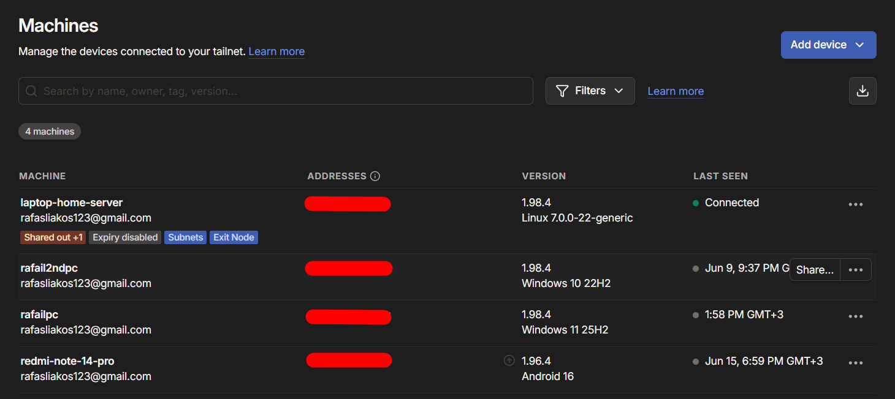
</p>

> *Figure 11: The final state of the Tailscale dashboard, displaying the obfuscated VPN IPs, the core server with all active routing badges (`Shared out`, `Expiry disabled`, `Subnets`, `Exit Node`), and the associated client devices.*

<a id="44-game-server-management-crafty-playitgg"></a>
### 4.4 Game Server Management (Crafty) & Playit.gg

Beyond core network infrastructure and file systems, the homelab is architected to operate as a high-performance entertainment hub. To host private, persistent multiplayer sessions without impacting production services, **Crafty Controller** was deployed via Docker. Crafty acts as an advanced, web-based daemon and orchestration panel that allows for the simultaneous deployment, monitoring, and hard-resource capping of multiple isolated game server instances from a single, unified graphical interface.

<p align="center">
  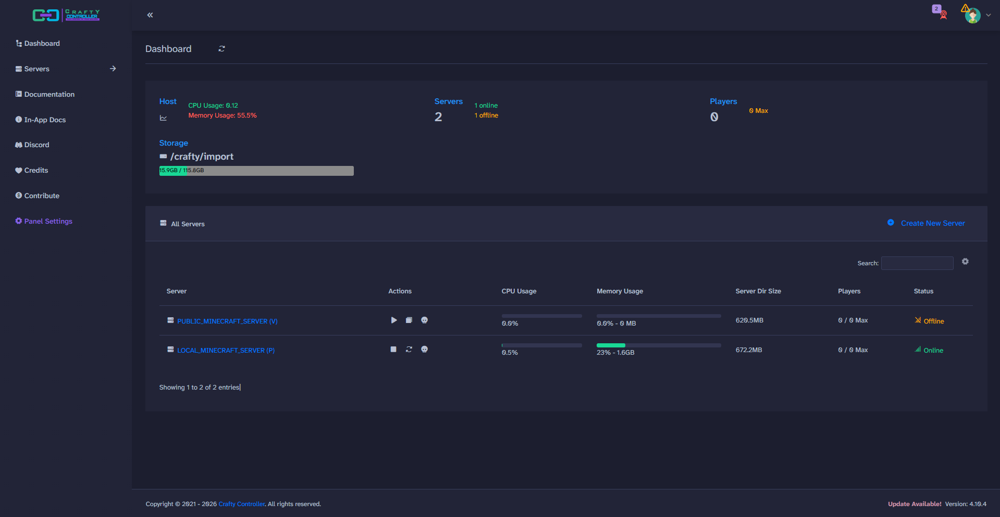
</p>

> *Figure X: The Crafty Controller unified dashboard managing both the Primary (Local) and Secondary (Public) isolated Minecraft instances, efficiently operating with minimal CPU overhead.*

#### 1. Bare-Metal Storage Strategy & I/O Performance Optimization
Game servers, particularly Minecraft Java Edition, are notoriously heavy on disk Read/Write operations due to constant chunk generation, world saving, and player position logging. Utilizing a mechanical drive for this task introduces catastrophic performance bottlenecks (TPS drops, block lag).

* **Storage Allocation:** To guarantee maximum Input/Output Operations Per Second (IOPS) and fluid chunk rendering, all Crafty Controller container paths and root server directories were strictly bound to the **120GB M.2 SSD** (OS Drive). The 1TB mechanical HDD is entirely bypassed for this workload to maintain fast response times.
* **Java Virtual Machine (JVM) Heap & RAM Budgeting:** The host system operates on a strict budget of 8GB DDR4 RAM. Since Minecraft allocations are un-swappable and reserved entirely upon boot, a meticulous memory management profile was enforced to prevent the Linux Out-Of-Memory (OOM) Killer from terminating critical core services (AdGuard, Tailscale, Netplan):
  * **Host OS & Containers Buffer:** 3.5GB to 4GB RAM is locked and reserved for system stability.
  * **Crafty Max Pool:** The combined allocation for all running game instances is strictly capped between 4GB and 4.5GB.

#### 2. Multi-Instance Provisioning & Port Multiplexing
To accommodate different game modes (e.g., a pure Vanilla survival world alongside a highly optimized modded environment), Crafty was configured to host and orchestrate multiple independent instances. To avoid network socket collisions on the host loopback interface, a strict port assignment strategy was implemented:

* **Minecraft Server 1 (Primary Instance):** Formatted using optimized server software (e.g., PaperMC) to maximize CPU thread utilization. This instance is bound to the default Minecraft networking socket:
  * Internal IP Protocol: `127.0.0.1` (Localhost)
  * Bound Port: **`25565`** (TCP/UDP)
* **Minecraft Server 2 (Secondary Instance):** Provisioned for experimental maps or alternative versions. To prevent a port binding conflict, the application configuration was manually altered to bind to the subsequent network socket:
  * Internal IP Protocol: `127.0.0.1` (Localhost)
  * Bound Port: **`25566`** (TCP/UDP)

<p align="center">
  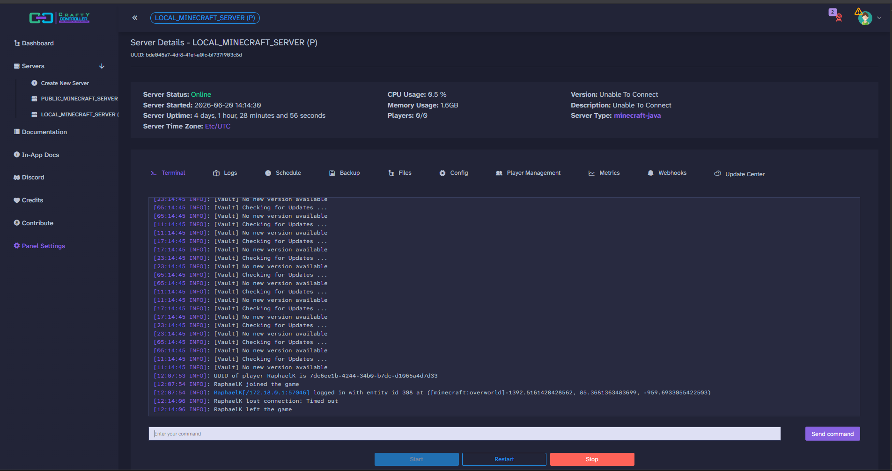
</p>

> *Figure Y: Live interactive terminal and resource monitoring for the primary game instance. The dashboard confirms the strict memory allocation policy is actively respected (currently utilizing 1.6GB RAM).*

<a id="441-secure-public-exposure-tunneling-architecture-playitgg"></a>
#### 4.4.1 Secure Public Exposure & Tunneling Architecture (Playit.gg)
Exposing these local game instances to external players presents a significant security risk. Traditional methods dictate utilizing **Port Forwarding** on the ISP router. However, this approach explicitly exposes the residential public WAN IP address to the open web, inviting persistent automated port scans, brute-force exploitation attempts, and catastrophic Distributed Denial of Service (DDoS) attacks. Furthermore, under Carrier-Grade NAT (CGNAT) environments, inbound port forwarding is physically blocked by the ISP.

To achieve maximum Operational Security (OPSEC), mask the home network entirely, and route traffic without modifying the primary firewall, a reverse-tunneling framework via **Playit.gg** was implemented. Playit operates a global network of distributed proxy edges. A localized, low-overhead native agent runs on the host OS, maintaining a secure, outbound persistent connection to the Playit cloud. External players connect directly to Playit's hardened public edge, which securely proxies the packets back down the established outbound tunnel directly to the respective local game sockets. **The home public IP address remains completely hidden and un-scannable.**

#### 1. Step-by-Step Native Linux Agent Deployment
The deployment of the Playit.gg agent onto the Linux server is fully automated utilizing the built-in CasaOS terminal interface and the official automated installation method.

* **Step 1: Accessing the Terminal Interface**
  1. Log into the centralized CasaOS web administration dashboard.
  2. From the main desktop utility menu, locate and open the native **Terminal** application.
  3. Authenticate into the shell execution profile by inputting the administrative superuser root credentials associated with the primary CasaOS deployment.

* **Step 2: Installing the Playit Agent**
  Within the active terminal sequence window, execute the following configuration scripts sequentially to refresh regional package lists, resolve the `curl` package hook dependency if it is missing, and execute the official automated service deployment binary script:
  ```bash
  sudo apt update && sudo apt install curl -y
  curl -fsSL https://packages.playit.gg/install.sh | bash
  ```

* **Step 3: Service Layer Initialization & Boot Persistence**
  While executing the standalone `playit` command in the terminal will successfully launch the agent in an interactive foreground session, this method is volatile; the routing tunnel will collapse the moment the terminal window is closed. 
  
  To guarantee high availability, run the process permanently in the background, and eliminate the need for manual intervention, the native `systemd` supervisor engine is utilized.

  To manually start the Playit background proxy handler on-demand:
  ```bash
  sudo systemctl start playit
  ```
  To configure the daemon execution flags to ensure that the agent runs permanently in the background and triggers an automatic startup handshake sequence whenever the underlying CasaOS host boots up or restarts:
  ```bash
  sudo systemctl enable playit
  ```

* **Step 4: Claiming the Agent to the Cloud Network**
  *(Note: The `sudo playit setup` command has been deprecated in recent versions. The claim link is now automatically generated in the background).*
  
  To fetch the single-use programmatic cryptographic activation node string, check the active service logs:
```bash
  sudo systemctl status playit
  ```
  *(If the link is truncated or not fully visible, view the active log feed by running: `sudo journalctl -u playit -f`)*

  Copy the explicit link address (formatted as `https://playit.gg/claim/...`) printed out onto the terminal stdout panel, parse it inside an active workstation web browser session, and follow the setup wizard prompt to claim the local software daemon to the cloud console network.

<p align="center">
  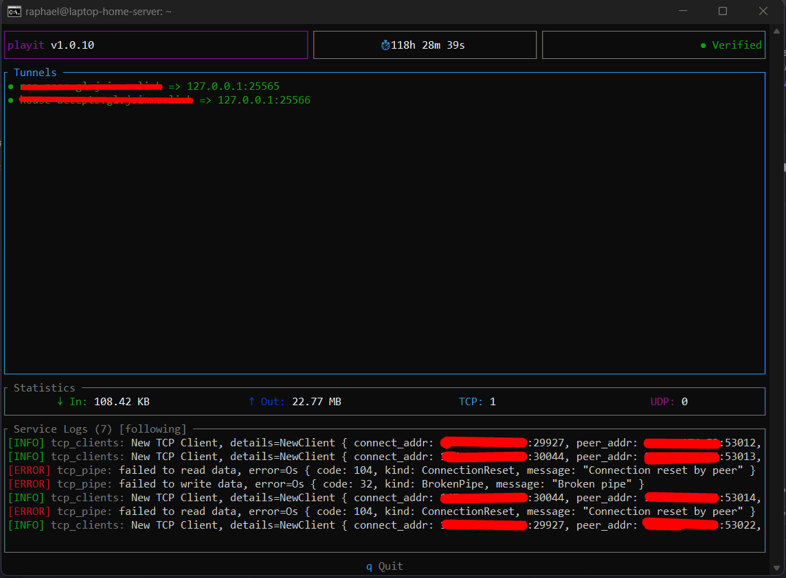
</p>

> *Figure 12: The local Playit agent running via the server terminal, displaying the live v1.0.10 connection stream, active TCP client handshakes, and the successful dual-tunnel port mappings down to sockets 25565 and 25566. Command: "playit"*

#### 2. Cloud Tunnel Multiplexing & Dual-Port Allocation
With the localized hardware agent successfully registered to the control plane, the network matrix was configured to handle incoming traffic multiplexing. Because the internal architecture runs two distinct, isolated game servers on independent sockets (`25565` and `25566`), two autonomous tunnel instances were defined inside the centralized panel interface.

* **Reviewing the Global Agent Matrix:**
  The centralized workspace indicates that the host node (`LAPTOP-HOME-SERVER`) is fully linked to the control account, reflecting the active mapping profiles.

<p align="center">
  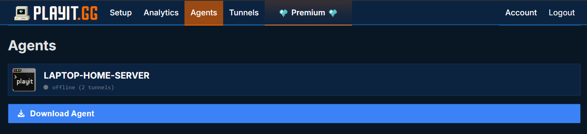
</p>

> *Figure 13: The master overview interface displaying the registered Linux hardware daemon synchronized with the account profile context.*

* **Evaluating Agent Parameters & Connection Architecture:**
  The underlying telemetry sheet verifies the structural properties of the background service daemon thread, registering the loopback network translation pathways.

<p align="center">
  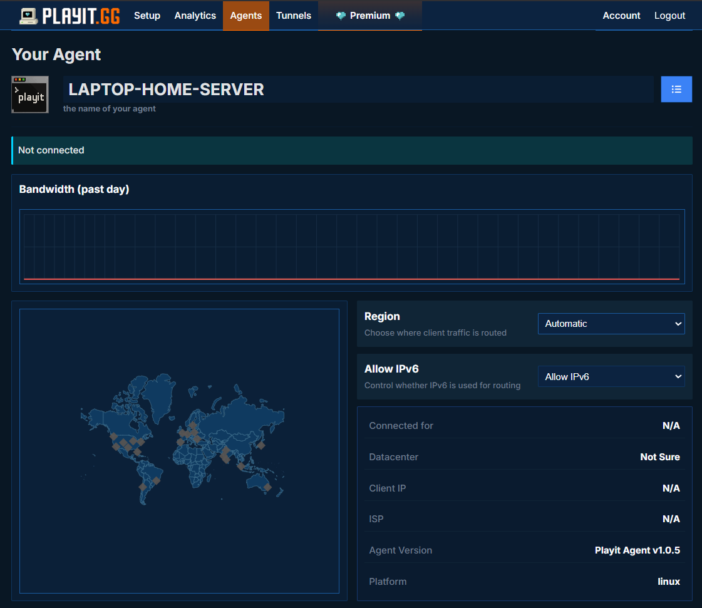
</p>

> *Figure 13: Reviewing the architectural mapping properties, software versioning, and internal OS layer profiles of the local agent thread.*

* **Multiplexed Custom Tunnel Pathway Allocations:**
  To safely feed traffic downstream into the isolated worlds without socket overlap collisions, the mapping parameters split the network boundary over two dedicated routing tunnels:

<p align="center">
  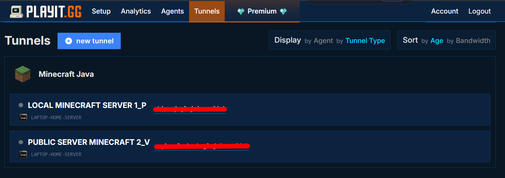
</p>

> *Figure 14: The active tunnel matrix showing the isolated game profiles successfully defined inside the cloud reverse proxy platform.*

  1. **Tunnel Pathway 1 (LOCAL MINECRAFT SERVER 1_P):** Binds the inbound global edge data straight onto the native standard game port socket (`127.0.0.1:25565`) using the optimized pre-configured template profiles.

<p align="center">
  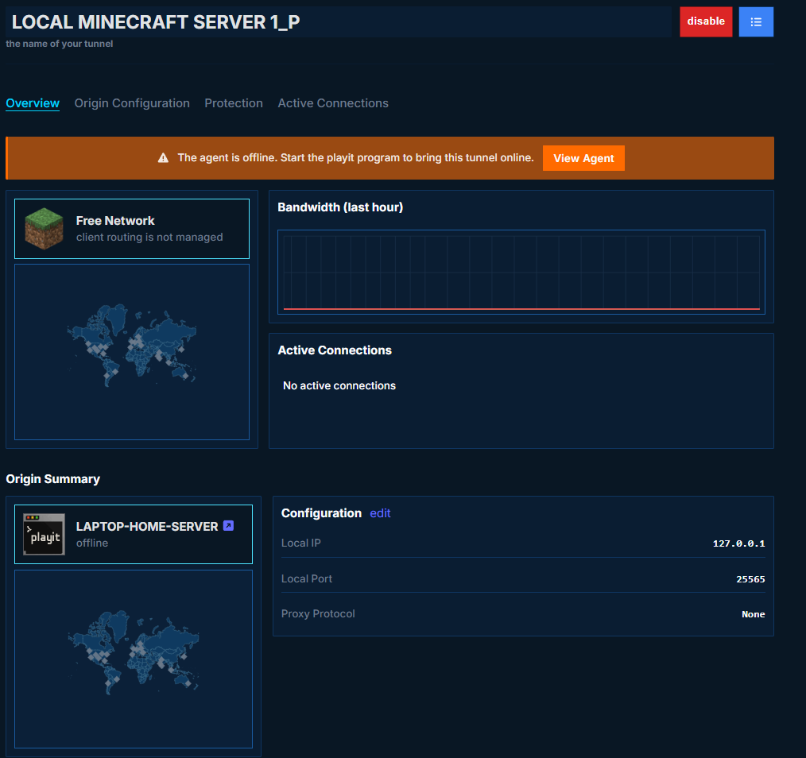
</p>

> *Figure 15: Structural blueprint mapping proxy endpoints down onto the primary loopback game socket port 25565.*

  2. **Tunnel Pathway 2 (PUBLIC SERVER MINECRAFT 2_V):** Establishes an alternate custom forward boundary path mapping incoming client packets directly over the designated experimental host port socket (`127.0.0.1:25566`).

<p align="center">
  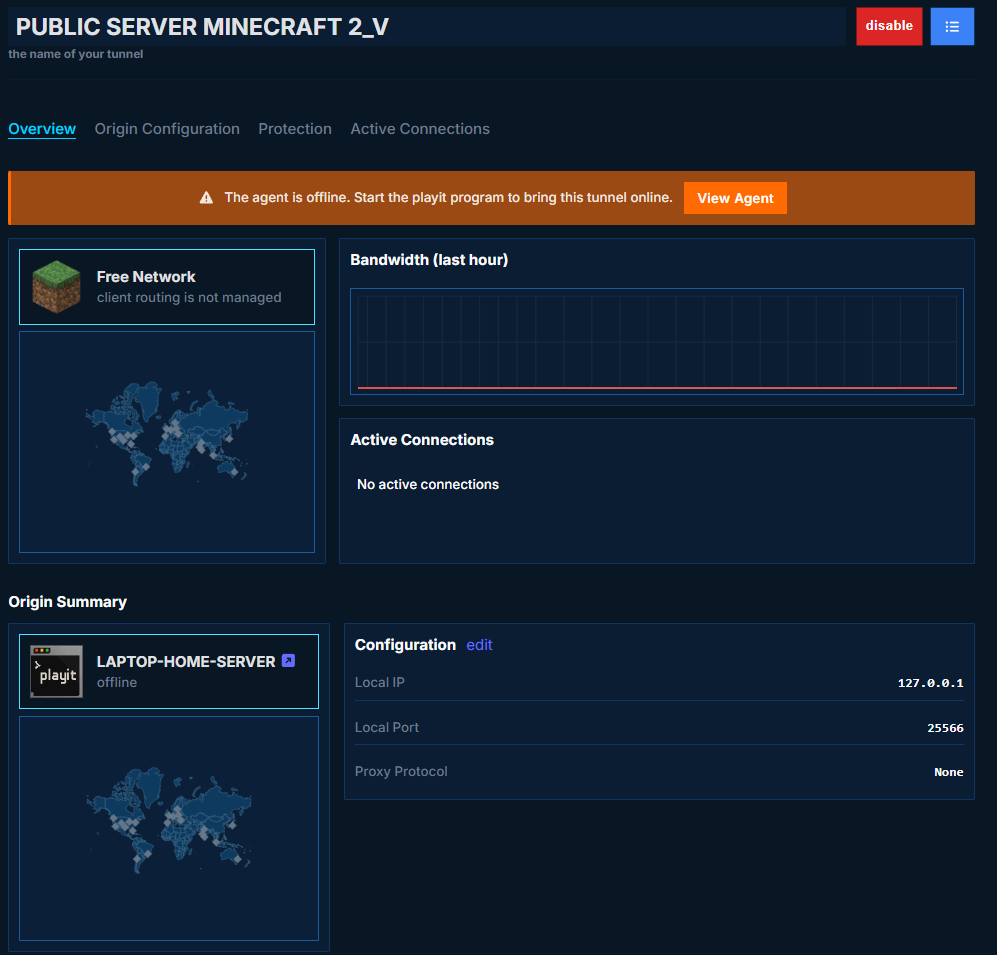
</p>

> *Figure 16: Custom custom-port proxy pathway rule successfully binding external inputs straight down to the internal 25566 socket.*

External users purely input these friendly obfuscated proxy domains into their multiplayer address box. Packet groups hitting the proxy node are decoded, packaged inside the secure reverse-proxy stream, and released precisely onto the host local loopback ports, seamlessly evading the home firewall.

#### 3. Operational State Notice: Infrastructure Cold Standby
* **Resource Optimization Policy:** Because game server daemons and Java runtime environments continuously consume background CPU cycles and aggressively lock down RAM chunks, both the Crafty game servers and the Playit native Linux agent are strictly configured to operate in a **Cold Standby** state when not actively utilized. 
* **State Management:** The services are kept down to guarantee 100% processing efficiency and memory overhead availability for the primary network infrastructure and data backups. However, the entire architecture remains completely provisioned, configured, and hardened; a single administrative SSH command can warm-boot the entire environment into an active, globally accessible production state within seconds.

<a id="45-media-server-jellyfin"></a>
### 4.5 Media Server (Jellyfin)

To centralize media consumption and eliminate reliance on commercial streaming services (like Netflix or Spotify), **Jellyfin** was deployed as a containerized application via CasaOS. Jellyfin acts as a fully private media server, automatically scraping metadata, cinematic posters, episode summaries, and subtitles from global databases. The platform seamlessly streams content across the network to Smart TVs, mobile devices, and tablets.

<p align="center">
  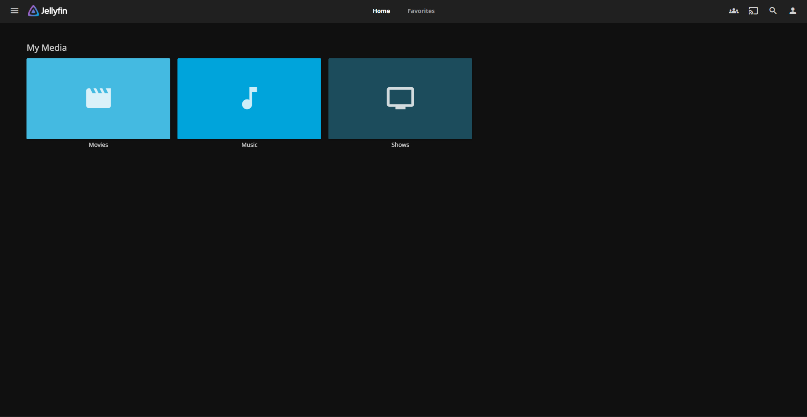
</p>

> *Figure 17: The Jellyfin administrative dashboard displaying the active server version, live client activity, and mapped container cache paths.*

#### 1. Storage Architecture & Library Organization
To ensure the media server indexes content accurately, an organized directory structure was established on the primary storage drive (`HDD-1TB`) under the `common` shared folder. 

* **Library Separation:** Dedicated folders were created for distinct media types (e.g., `Tainies` for movies, `Seires` for TV shows).
* **Content Type Mapping:** During the initial Jellyfin setup, it was critical to map these folders to their strict respective Content Types (`Movies` vs. `Shows`). This precise mapping prevents database confusion, allowing Jellyfin to organize TV series properly by seasons and fetch correct episodic metadata rather than mistaking them for standalone movies.

<p align="center">
  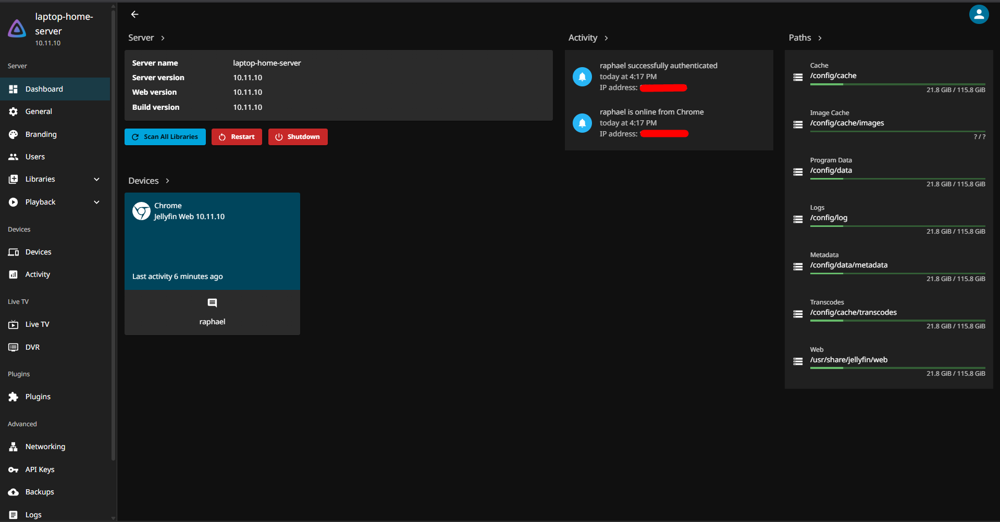
</p>

> *Figure 18: The client-side interface reflecting the strict library separation (Movies, Music, Shows) successfully enforced during the directory mapping phase.*

#### 2. Network Security & Zero-Trust Configuration
During deployment, strict networking rules were enforced to maintain the integrity of the home firewall.

* **LAN Access:** The *"Allow remote connections to this server"* option was explicitly enabled, permitting client devices within the local physical network to discover and stream from the server.
* **UPnP & Port Forwarding Denial:** The *"Enable automatic port mapping"* option was strictly **disabled**. Permitting applications to utilize UPnP to dynamically open external ports on the Cosmote ISP router represents a critical security vulnerability. Remote access to the media server from outside the home is exclusively and securely handled by the authenticated Tailscale VPN mesh, adhering to Zero-Trust principles.

#### 3. Hardware Acceleration & Linux GPU Passthrough
*(Note: The system is configured to prioritize the dedicated NVIDIA GPU for hardware-accelerated tasks, such as real-time video transcoding, significantly offloading the CPU during high-demand media consumption).*

To process heavy 4K files or stream to legacy devices that require real-time video conversion (Transcoding), the laptop's dedicated **NVIDIA GTX 1050 Ti (2GB GDDR5)** was utilized. Because Jellyfin operates within an isolated Docker container in CasaOS, the host Linux environment required specific driver modifications to expose the GPU to the containerized environment.

**Executing the NVIDIA Container Toolkit Integration:**
This is the exact sequence in which the commands must be executed in the terminal, from start to finish. Execute them one by one, waiting for the previous one to complete before moving to the next.

**Part 1: Installing Nvidia Drivers**

1. Update the package lists:
```bash
sudo apt update

2. Automatically install the official Nvidia drivers:
```bash
sudo ubuntu-drivers install
```

3. Reboot the machine/server to apply the drivers:
```bash
sudo reboot
```
*(Once the server reboots, reconnect to your terminal and proceed with Part 2.)*

**Part 2: Installing the NVIDIA Container Toolkit (Docker)**

4. Add the official NVIDIA Container Toolkit GPG repository key:
```bash
curl -fsSL https://nvidia.github.io/libnvidia-container/gpgkey | sudo gpg --dearmor -o /usr/share/keyrings/nvidia-container-toolkit-keyring.gpg
```

5. Inject the repository into the local APT sources list:
```bash
curl -s -L https://nvidia.github.io/libnvidia-container/stable/deb/nvidia-container-toolkit.list | \
  sed 's#deb https://#deb [signed-by=/usr/share/keyrings/nvidia-container-toolkit-keyring.gpg] https://#g' | \
  sudo tee /etc/apt/sources.list.d/nvidia-container-toolkit.list
```

6. Update the system again to recognize the new repository:
```bash
sudo apt update
```

7. Install the toolkit package:
```bash
sudo apt install -y nvidia-container-toolkit
```

8. Configure the Docker daemon to recognize the NVIDIA runtime:
```bash
sudo nvidia-ctk runtime configure --runtime=docker
```

9. Restart the Docker service to save the changes:
```bash
sudo systemctl restart docker
```

**Verification Check**
To ensure everything was configured correctly, run the following command in the terminal:
```bash
nvidia-smi
```
*If a table appears displaying the information for the GTX 1050 Ti, you are all set and ready to open CasaOS.*

#### 4. Jellyfin Transcoding Optimization (NVENC)
With the GTX 1050 Ti successfully passed through to the Docker container, Jellyfin's internal playback settings were meticulously optimized to leverage the GPU for hardware-accelerated video decoding and encoding. This ensures smooth playback across all network devices while keeping the host CPU utilization near zero.

The following parameters were hardcoded within the Jellyfin Dashboard -> Playback settings:

* **Hardware Acceleration API:** Set to **Nvidia NVENC**.
* **Hardware Decoding:** Enabled across all supported codecs (H264, HEVC, MPEG2, VC1, VP9, HEVC 10bit, and VP9 10bit) to maximize hardware offloading.
* **Enhanced NVDEC Decoder:** Enabled to leverage Nvidia's advanced decoding implementation.
* **Hardware Encoding:** Enabled, specifically allowing **HEVC format encoding** for superior bandwidth efficiency. *(Note: AV1 encoding was deliberately left unchecked, as it is natively unsupported by the Pascal/GTX 10-series architecture)*.
* **Tone Mapping:** Enabled (utilizing the BT.2390 algorithm) to accurately transcode HDR10/DoVi content down to SDR displays without washing out the cinematic colors.
* **Subtitle Extraction:** Enabled on the fly to prevent the video playback from stalling during text extraction processes.
* **Throttle Transcodes:** Enabled. This is a critical power-management setting that pauses the GPU transcoder once a sufficient playback buffer (configured to 180 seconds) is built, significantly reducing power consumption, thermal output, and preventing continuous 100% GPU utilization.

<a id="46-netalertx-network-monitoring"></a>
### 4.6 NetAlertX (Network Monitoring)

To maintain complete visibility over the physical and wireless Local Area Network (LAN), **NetAlertX** was deployed as a containerized network security scanner. Operating as an automated watchdog, it continuously sweeps the local network to detect rogue devices, monitor the uptime of known endpoints, and maintain detailed connection logs.

<p align="center">
  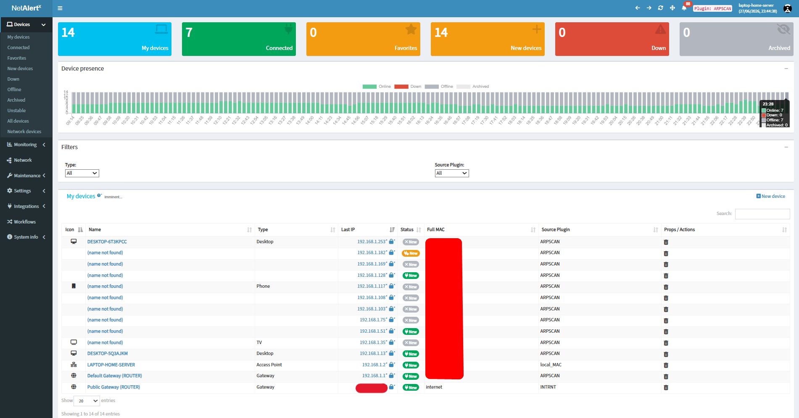
</p>

> *Figure 19: The NetAlertX dashboard displaying real-time network presence, active ARP scans, and tracking both local endpoints and the external WAN Gateway.*

#### Core Monitoring Capabilities

* **Active Device Discovery (ARP Scanning):** Utilizing the `ARPSCAN` plugin, the system continuously polls the `192.168.1.0/24` subnet. It aggressively maps active IP leases to their physical hardware MAC addresses, instantly identifying any newly connected phones, PCs, or IoT devices.
* **State Tracking & Presence Timeline:** The upper dashboard generates a continuous visual timeline graph. This telemetry logs the exact connection and disconnection timestamps of all network clients, establishing a clear behavioral baseline for household devices.
* **Gateway & WAN Monitoring:** Beyond local host tracking, the service actively monitors the health of the local Default Gateway (`192.168.1.1`). Furthermore, it utilizes the `INTRNT` plugin to track the router's external Public IP, logging any dynamic WAN IP changes initiated by the ISP.
* **Rogue Access Alerting:** Any unrecognized MAC address connecting to the router's Wi-Fi or the physical network switch is immediately classified and flagged under the "New devices" threshold. This ensures rapid identification and mitigation of unauthorized network access attempts.

<a id="5-future-expansions"></a>
## 5. Future Expansions

A homelab is inherently an ongoing journey rather than a finished product. While the current infrastructure fulfills all initial project goals securely and efficiently, several logical expansions are planned as the household's digital needs evolve:

* **Hardware RAM Upgrade:** The system currently operates on a strict memory budget (8GB). Populating the empty SODIMM slot to upgrade the system to 16GB or 32GB will provide significant breathing room, allowing for the deployment of heavier Docker containers and more concurrent game server instances without risking OOM (Out of Memory) terminations.
* **The 3-2-1 Backup Strategy:** While the current automated local backup to the external 1TB USB drive protects against drive failure or accidental deletion, it does not protect against physical disasters (theft, fire, power surges). A future goal is to implement an offsite backup, either by encrypting data and sending it to a secure cloud bucket (like Backblaze B2) or by deploying a secondary remote node (e.g., at a relative's house) connected securely via Tailscale.
* **Home Automation (Home Assistant):** To further the "De-Clouding" vision, deploying Home Assistant would allow the family to strip IoT devices (smart TVs, local switches, cameras) away from proprietary vendor clouds, centralizing their control locally for better privacy and faster response times.
* **Advanced Telemetry & Analytics:** While CasaOS and NetAlertX provide excellent real-time overviews, deploying a dedicated metrics stack (such as Prometheus + Grafana) will allow for historical tracking of the hardware's health (especially laptop thermal metrics, GPU usage, and network traffic over time).

<a id="6-conclusions"></a>
## 6. Conclusions

This project successfully proves that achieving digital sovereignty and "De-Clouding" does not require enterprise budgets or massive, power-hungry rack servers. By upcycling an aging gaming laptop, an idle piece of hardware was given a second life, preventing e-waste while ingeniously utilizing its built-in battery as a native UPS. 

Building this homelab was an intensive learning curve that bridged the gap between theoretical networking and practical Systems Administration. It required navigating low-level Linux hardware quirks (EFI/NVRAM patching), managing Docker networking layers, resolving complex OSI Layer 7 permission conflicts (Samba vs. EXT4), and responding in real-time to Zero-Day security disclosures (OpenSSH). 

Today, this laptop sits silently in a rack, serving as the digital backbone for an entire household. It seamlessly filters out thousands of malicious web requests daily, provides a secure Zero-Trust gateway for remote access, safely stores family memories, and serves as an independent entertainment hub. Ultimately, this project transitions the user from being a passive consumer of Big Tech services to becoming the absolute owner and administrator of their own digital footprint.
